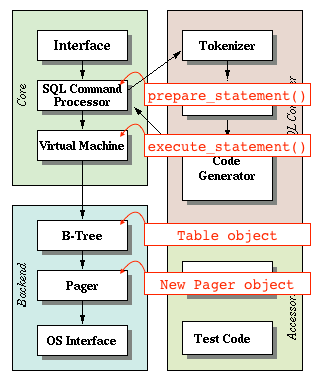
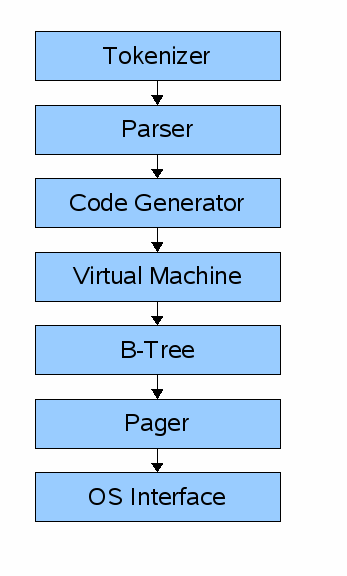
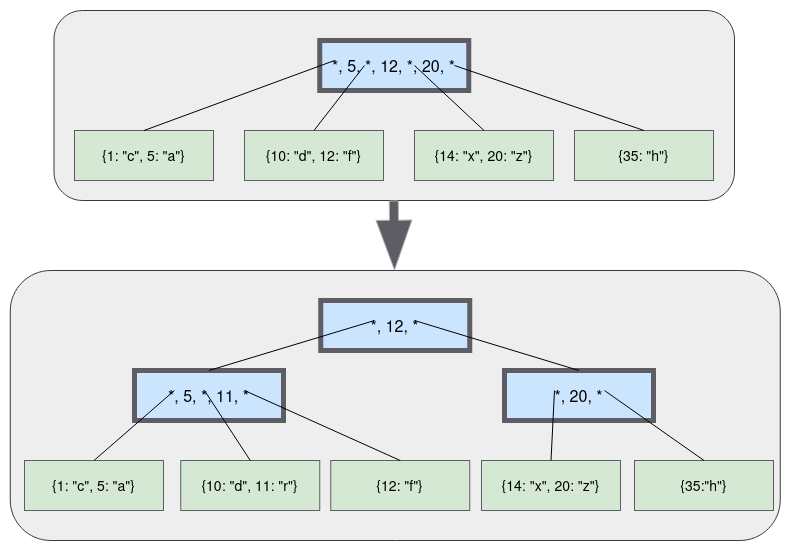

# A. questions

- What format is data saved in? (in memory and on disk)
- When does it move from memory to disk?
- Why can there only be one primary key per table?
- How does rolling back a transaction work?
- How are indexes formatted?
- When and how does a full table scan happen?
- What format is a prepared statement saved in?
- In other words, how does a database work?

In other words, how does a database work?

# B. architecture 

이게 b-tree

- 이게 꽉차면 split 하는거. 양쪽 균형 맞추면서. 
- 일정한 read O(log N)성능 위해

# C. index 

1. REPL
2. sql compiler & virtual machine 
3. in-memory, append-only, single-table database
4. persistence to disk
5. cursor abstraction 
6. b-tree 
7. binary search and duplicate keys
8. splitting a leaf node
9. recursively searching the b-tree
10. scanning multi level b-tree
11. updating parent node after a split
12. splitting internal nodes

# D. reference
https://cstack.github.io/db_tutorial/
