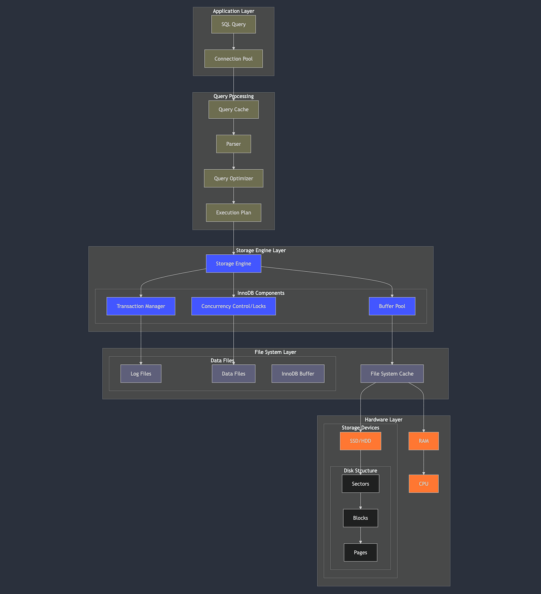
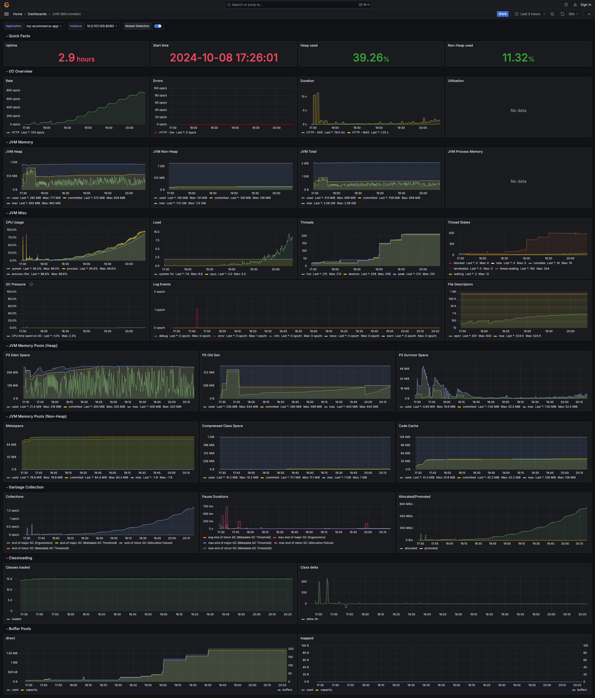

- Q1. how read works?
- Q2. how write works?

# Q. how read works in b+tree based RDB?

## --- 1. application layer ---
1. step1. sql query -> connection pool 
    - 백엔드에서 쿼리 요청하는데 스레드 풀에 담긴 스레드 하나가 rdb에서 연결 담당하는 스레드풀에 rds-connection용 스레드랑 통신함. 쿼리 넘겨줌. 
    - PMM metrics에 `com_set_options`이 idle thread in thread pool에 요청 날리는 것. 아니면 부하 더 많아져서 thread 늘려야 한다는 요청 날리는거나.
## --- 2. query processing layer --- 
2. step2. query caching
    - 쿼리가 캐싱되어있는지 확인하고 캐싱되있으면 값 바로 반환 
    - mysql 5.7까지만 했었고, mysql 8.0 이후로는 삭제됨 
    - 테이블 데이터가 단 한 줄이라도 변경되면 그 테이블과 관련된 캐시를 모두 삭제(invalidation)해야 했기 때문입니다. 이로 인해 쓰기 작업이 빈번한 환경에서는 캐시를 유지하는 비용이 더 커져 성능 저하의 원인이 되었습니다.
    - 쿼리 캐싱은 옛날방식. sql 쿼리 +  그 결과를 메모리에 그대로 저장하는건데, 테이블에 write하면 얘도 삭제했어야 했어서 비효율이어서 없어졌잖아?
    - InnoDB bufferpool(현대 방식): 쿼리 결과가 아닌, 디스크의 데이터와 인덱스 페이지(Page) 자체를 메모리에 캐싱합니다. 어떤 쿼리가 들어오든 필요한 데이터/인덱스 페이지가 버퍼 풀에 있다면 디스크를 읽지 않고 메모리에서 바로 처리합니다. 이것이 훨씬 효율적이고 재사용성이 높습니다.
    - db read optimize를 할 때 개발자나 DBA가 가장 중요하게 여기는 설정은 바로 이 innodb_buffer_pool_size입니다. 보통 RDS RAM 메모리의 50~70%까지 설정하여 디스크 I/O를 최소화하는 것을 목표로 합니다.
3. step3. parser
    - 파서가 쿼리를 파싱함 하여 select, from, where의 계층적 tree로 만듬. 
    - sql 문법 에러 있으면 여기서 바로 return 
4. step4. query optimizer & execution plan  
    - 옵티마이저한테 쿼리를 넘겨주면, 어떤 방식,순서로 쿼리해야 가장 효과적인지 roadmap을 짜서 cost가 가장 낮은 애를 고름 
    - 그 기준은 index를 어떤걸 써서 쿼리할지,(hash index, unique index, text based index) 
        - type이 ALL(풀 테이블 스캔)이나 index(풀 인덱스 스캔)가 아닌 ref, eq_ref, const 등으로 나오는지 확인합니다.
        - Extra 필드에 Using filesort, Using temporary가 뜨지 않도록 쿼리나 인덱스를 수정합니다.
    - join할 때 테이블 join 순서(사이즈가 큰 테이블이 작은 테이블을 join거는 쪽으로)
    - 어떤 join할지(nested join, sort merge join, hash join)
    - 경우의수 4 * 3 * 3 = 36가지라고 치면, 그중에서 제일 cost 낮은 쿼리를 고름 
    - query에 hint있으면 참고하는 편이나, 현대 optimizer가 굉장히 발달했기 때문에, hint는 엄청 확실하고 엄청 성능 요하고 엄청 안바뀌는 금융코드 아니면 박지마
    - Q. 만약 인덱스 탄다고 하면, 인덱스 컬럼이 있는 b+tree로 leafnode에 실제 데이터의 위치를 파악하고, 여기서 헤깔리는부분인데, 이 실제 데이터의 위치를 가지고 바로  clustering index(b+tree인데 pk가 키고, leaf node에 실제 데이터가 있는 것)
    - A. index건 컬럼이 든 b+tree의 leaf node에 목적하는 데이터의 pk가 들어있는데, 이걸 가지고 다시 clustering index b+tree에 서치해서 leaf node에서 원본 데이터 가져감 
## --- 3. storage engine layer ----
3. step5. buffer pool 
    - InnoDB는 가장 먼저 버퍼풀을 확인해서, 만약에 페이지가 버퍼풀에 캐싱되어 있었다면, disk i/o없이 순수 메모리 내에서 b+tree 탐색이 일어남. 
    - 버퍼 힛! 이게 젤 빠른 시나리오. 
    - buffer pool의 cache hit 99%이상 목표해야 하고, 낮아지면 full scans이 버퍼풀 오염시키는지 확인해야 함. 

## --- 4. disk layer --- 
4. step6. buffer pool cache miss -> disk i/o
    - buffer pool에 cache miss나면, InnoDB는 디스크로부터 해당 page 읽어오라고 파일 시스템에 요청함
    - os는 먼저 파일 시스템 캐시를 확인하고, 없으면 물리디스크에서 접근함. 
    - hardware layer에서 SDD/HDD가 디스크의 특정 sector에 접근하여 page가 포함된 block을 읽어 RAM에 전송함. 
    - 읽어온 페이지는 버퍼 풀의 빈 공간(Frame)에 적재되고, LRU 리스트 같은 자료구조가 업데이트됩니다. 이제 해당 페이지는 버퍼 풀에 있으므로, 중단됐던 메모리 내 탐색 과정을 재개합니다. 

## --- 5. storage engine layer again --- 
5. step7. transaction manager & lock manager for concurrency & transaction
    - 디스크에서 가져온 page안 데이터를 읽을 때, isolation level에 따라 lock 걸고 읽어야 할 때도 있다. 
    - MVCC(multi version concurrency control): `SELECT` 쿼리는 현재 트랜잭션의 격리 수준(Isolation Level)에 맞는 버전의 데이터를 읽어야 합니다. 만약 현재 페이지의 데이터가 다른 미커밋 트랜잭션에 의해 수정되었다면, InnoDB는 **언두 로그(Undo Log)** 를 참조하여 현재 트랜잭션이 볼 수 있는 이전 버전의 데이터를 생성해서 반환합니다. 이 덕분에 일반적인 SELECT는 다른 트랜잭션을 블로킹하지 않습니다. (Non-locking Read)
    - 락킹(Locking): 만약 SELECT ... FOR UPDATE나 SELECT ... FOR SHARE 구문이라면, 해당 로우(Row)나 갭(Gap)에 배타 락(Exclusive Lock)이나 공유 락(Shared Lock)을 설정하여 다른 트랜잭션의 접근을 제어합니다.
6. step8. return data 

## 실제 100~800RPS 테스트의 ec2 & RDS APM 
### ec2의 APM metrics 

### RDS의 APM metrics 

#### PMM 중요 metrics 
- 주요지표 
    - QPS (query per second)
        - select, update, insert, delete 가 쿼리가 몇번 수행되는지 (쿼리 하나에 여러개 N개 있어도 N개로 침. 물리적인 쿼리 run한 양)
    - TPS (transaction per second)
        - 쿼리 다 실행하고 commit 한 횟수. 논리적인 작업 성공률. 1비즈니스 로직 = 1 TPS라고 봐도 무방할 듯. 
    - Buffer Pool Hit Rate
        - DB read성능의 가장 핵심적인 지표. 보통 cache hit rate 99%이상을 목표로 함. 
        - cache hit 99% 아래면, 버퍼풀 늘리거나, 인덱스 안타는 풀스캔 쿼리가 많다는 뜻이므로(풀스캔 한 잘 안읽는 page를 buffer pool에 넣는 것)
    - Buffer pool usage 
        - 버퍼 풀 사용량 
        - 사용량이 100%에 가깝다면 늘려줘야 되는 시기.
        - 보통 RDS RAM에 50% ~ 70% 까지 할당함 
    - CPU usage 
        - ec2는 cpu usage가 한 70~80%가 적절하고, db는 40%~70% 유지가 적절
- === MySQL Instance Summary (상단) ===
    - QPS (Queries Per Second): 초당 처리되는 쿼리 수. 데이터베이스가 얼마나 많은 작업을 처리하는지 보여주는 핵심 부하 지표입니다.
    - InnoDB Buffer Pool: InnoDB 엔진이 사용하는 메모리 캐시의 총 크기(2.19 G)를 보여줍니다.
    - MySQL Connections: 현재 연결된 클라이언트의 수입니다.
- === thread pool connections ===
    - MySQL Client Thread Activity:
        - Threads_running: 현재 활발하게 쿼리를 실행 중인 스레드의 수입니다.
        - Threads_connected: 현재 연결된 총 스레드 수입니다.
- === query related === 
    - Frequency Histograms & Slow Queries:
        - Com_... (select, insert, update, delete 등): 실행된 쿼리의 유형별 비율을 보여줍니다. 워크로드가 읽기 중심인지 쓰기 중심인지 파악할 수 있습니다.
        - MySQL Slow Queries: long_query_time 설정값을 초과한 느린 쿼리의 수를 보여줍니다.
    - Select Types & Sorts
        - 어떤 종류의 SELECT 쿼리가 실행되었는지, 정렬(Sort) 작업이 어떻게 수행되었는지를 보여줍니다.
        - Select_full_join: JOIN 시 양쪽 테이블 모두에서 풀 스캔이 발생했음을 의미합니다. 인덱스가 전혀 사용되지 않는 최악의 조인 방식입니다 
        - Sort_merge_passes: 정렬할 데이터가 너무 많아 메모리(sort buffer)에 담지 못하고, 임시 디스크 공간을 사용해 여러 번에 걸쳐 정렬(merge sort)했음을 의미합니다
        - Select_full_join이나 Sort_merge_passes 수치가 높게 나타난다면, 이는 인덱스 설계가 잘못되었거나 매우 비효율적인 쿼리가 실행되고 있다는 강력한 증거입니다. 특히 Sort_merge_passes는 디스크 I/O를 유발하므로 반드시 해결해야 할 문제입니다
    - Table Locks & Questions 
        - Table_locks_waited: 테이블 레벨 락(Lock)을 얻기 위해 대기한 횟수입니다.
        - Table_locks_immediate: 대기 없이 즉시 테이블 락을 얻은 횟수입니다.
        - Questions: 클라이언트가 서버로 보낸 총 요청(쿼리) 수입니다.
        - Table_locks_waited 수치가 높다면 테이블 레벨에서 심각한 경합(Contention)이 발생하고 있다는 의미입니다. 주로 MyISAM 스토리지 엔진을 사용하거나, 트랜잭션 중 명시적으로 테이블을 잠글 때 발생하며 병목 현상의 직접적인 원인이 됩니다.
- === network === 
    - mysql network traffic
        - 네트워크가 병목되는 경우는 드물긴 한데, 대용량 데이터 한번에 전송하는 배치작업할 때나 주요하게 봐야하는 메트릭
    - mysql network usage hourly 
- === mysql internals === 
    - mysql internal memory overview
        - 여기서 시스템 전체 RDS에 부여된 메모리가 4gib인데, buffer pool에 할당된 메모리가 2gib를 확인할 수 있다. 
    - top command counters 
        - set_option, select, commit, insert, update 의 비율이 어떻게 되는지 보여준다. 
        - Q. com_set_option이 제일 비율이 높은데, (그 다음은 select) 얘는 query에서 어떤 부분인거지?
        - A. Com_set_option은 실제 SELECT나 INSERT 같은 데이터 조작 쿼리가 아니라, 데이터베이스 연결(Connection)이 생성되거나 초기화될 때 호출되는 내부 설정 명령어. 부하가 늘어서 connection pool에서 새 커넥션 만들 때 호출됨 + idle 상태였던 connection 깨울 때 호출됨. 부하테스트에 RPS가 높다면 이 수치가 높은게 당연한 것.
    - mysql handlers
        - MySQL이 스토리지 엔진 레벨에서 데이터를 어떻게 읽고 쓰는지를 보여주는 저수준(low-level) 카운터입니다.
        - `Handler_read_rnd_next`: 데이터 파일의 처음부터 끝까지 순차적으로 읽은 횟수입니다. 풀 테이블 스캔의 전형적인 지표입니다.
        - `Handler_read_next`: 인덱스 순서에 따라 다음 데이터를 읽은 횟수입니다. (좋음, 인덱스 레인지 스캔)
        - `Handler_read_key`: 인덱스를 통해 정확한 위치의 데이터를 찾은 횟수입니다. (좋음)
        - Handler_read_rnd_next 수치가 Handler_read_key나 Handler_read_next에 비해 비정상적으로 높다면, 인덱스를 타지 못하는 쿼리가 많다는 확실한 증거입니다. EXPLAIN의 type: ALL과 같은 의미를 갖습니다. 
    - mysql transaction handlers
        - 스토리지 엔진 레벨에서 트랜잭션이 어떻게 처리되고 있는지를 보여주는 카운터
        - `Handler_commit`: 트랜잭션이 성공적으로 완료되어 커밋(Commit)된 횟수입니다.
            - 정상 상태 확인: 일반적으로 Handler_commit 수치가 꾸준히 증가하는 것이 정상입니다. 이는 작업들이 성공적으로 데이터베이스에 반영되고 있음을 의미합니다.
        - `Handler_rollback`: 트랜잭션이 실패하거나 명시적으로 취소되어 롤백(Rollback)된 횟수입니다.
            - Handler_rollback 수치가 예상치 못하게 높다면, 애플리케이션 로직에 문제가 있거나, 데드락(Deadlock)이 발생했거나, 제약 조건 위반 등으로 인해 트랜잭션이 계속 실패하고 있다는 강력한 신호입니다. 즉시 원인을 파악하고 해결해야 합니다. 
        - `Handler_savepoint`: 트랜잭션 내에서 SAVEPOINT가 설정된 횟수입니다.
        - `Handler_savepoint_rollback`: SAVEPOINT로 롤백된 횟수입니다
    - process state
        - SHOW FULL PROCESSLIST 명령의 결과를 시각화한 것으로, 각 스레드가 현재 어떤 상태에 있는지를 보여줍니다.
        - Threads_running이 높을 때, 스레드들이 구체적으로 어떤 상태(State 컬럼)에서 시간을 보내는지 파악할 수 있습니다. 예를 들어 Copying to tmp table, Sorting result, locked 등의 상태가 많이 보인다면, 이것이 바로 성능 저하의 원인입니다
    - query cache
        - 과거(mysql 5.8)에 사용되었던 쿼리 캐시 관련 지표입니다
        - mysql8.0 이후 부터는 항상 no data라고 나올 것. 
- === disk level === 
    - mysql file openings
    - mysql open files 
    - mysql table open cache status
        - 의미: 테이블을 열 때 테이블 캐시를 얼마나 효율적으로 사용했는지를 보여줍니다.
        - Opened_tables: 테이블 캐시에 없어 디스크에서 직접 테이블 정의 파일을 열어야 했던 횟수입니다.
        - Opened_tables 수치가 지속적으로 빠르게 증가한다면, table_open_cache와 table_definition_cache 설정값이 작다는 의미일 수 있습니다. 수천 개의 테이블을 사용하는 대규모 환경에서는 이 캐시 크기를 튜닝하는 것이 중요할 수 있습니다
    - mysql open tables
    - mysql table definition cache 
- === 추가해야할 메트릭 ===
    - InnoDB Buffer Pool Hit Rate
        - 얼마나 많은 데이터 읽기를 디스크가 아닌 메모리(버퍼 풀)에서 처리했는지 보여주는 핵심 지표입니다. 99% 이상을 목표로 합니다
        - 보통 innodb_buffer_pool_size 사이즈를 늘려서 read 성능 개선한다. 
        - 자주 사용되지는 않는데 full scan해서 용량만 많이 잡는 쿼리를 찾아 최적화 한다. 
        - 공식: hit rate = (1 - `InnoDB Data Reads` / `InnoDB Buffer Pool Requests`) * 100 
            - `InnoDB Buffer Pool Requests`: 논리적 읽기 요청
                - 쿼리 처리를 위해 InnoDB가 데이터 페이지를 요청한 총 횟수입니다. 
            - `InnoDB Data Reads`: 물리적 디스크 읽기 
                - 요청된 페이지가 버퍼 풀에 없어 디스크에서 직접 읽어온 실패(Miss) 횟수입니다

## InnoDB 이해 
### 1. buffer pool에 대한 이해 
#### Q. full scan을 피하라는 이유 
1. 단순히 테이블 전체 rows 읽는게 시간 오래걸림 
    - 물론 테이블 사이즈 작으면, b+tree에 leaf node들이 다 옆으로 이어져 있으니까, 나름 풀스캔도 빠르긴 함. 그래서 테이블 사이즈 작으면, 인덱스 b+tree 한번 더 타고, 읽는 것 보다, pk가 있는 b+tree leaf node fulls can이 더 빠를 때도 있음. 
    - 버퍼풀을 오염시킴. 풀 스캔으로 읽어온, 거의 재사용되지 않을 "차가운(cold)" 데이터 페이지들이 한정된 메모리 공간인 버퍼 풀을 대량으로 차지합니다. 이로 인해 정말 자주 사용되어야 할 "뜨거운(hot)" 데이터 페이지(주로 인덱스 페이지)들이 버퍼 풀에서 밀려나게 됩니다. -> 버퍼풀에 캐시 히트 99%가 줄어듬 -> disk i/o를 함 -> 느려짐 

### 2. Adaptive Hash Index 
InnoDB가 B-Tree 인덱스 접근을 더 빠르게 하기 위해 내부적으로 만드는 해시 인덱스입니다.

## MVCC에 대한 이해 
Multi-Version Concurrency Control 

### A.1.1. "read는 write를 막지 않고, write는 read를 막지 않는다" 가 목표 
Q. 만약 [[MVCC]]가 없었다면?
- 한 트랜잭션(Writer)이 특정 로우를 수정(`UPDATE`)하려고 배타 락(Exclusive Lock)을 겁니다.
- 이때 다른 트랜잭션(Reader)이 그 로우를 읽으려고 하면, Writer가 커밋(Commit)하여 락을 해제할 때까지 **기다려야 합니다.**

이 방식은 데이터 정합성은 보장하지만, 하나의 쓰기 작업 때문에 수많은 읽기 작업이 멈추는 **블로킹(Blocking)** 이 발생하여 시스템 전체 성능이 심각하게 저하됩니다.

---
Q. how MVCC solved this problem?
A. 이 두개 장치를 이용하여 concurrency 문제를 해결함. 
- **언두 로그 (Undo Log):** 단순히 트랜잭션을 롤백(Rollback)하기 위한 용도뿐만 아니라, 데이터가 변경되기 **이전 버전의 내용**을 별도로 저장하는 **'데이터의 히스토리 보관소'** 역할을 합니다.
- **숨겨진 컬럼 (Hidden Columns):** InnoDB의 모든 로우(Row)에는 사용자가 보지 못하는 3개의 숨겨진 필드가 있습니다.
    1. `DB_TRX_ID` (6-byte): 이 로우를 마지막으로 수정한 트랜잭션의 고유 ID.
    2. `DB_ROLL_PTR` (7-byte): **언두 로그 포인터.** 이 로우가 수정되기 이전 버전의 데이터가 저장된 언두 로그 내의 위치를 가리킵니다. 이 포인터를 통해 버전의 연결고리(Version Chain)가 만들어집니다.
    3. `DB_ROW_ID` (6-byte): 로우를 식별하는 고유 ID (PK가 없을 경우 내부적으로 사용됨).

#### A.1.1.1. example 
1. update 쿼리를 날렸다고 치자.
2. 그 row에 original 버전은 undo log에 일단 써
3. @start transaction 으로 락 걸고 업데이트 도중임. 저 hidden field에 origin버전이 undo log에 어딨는지 위치 적어논 상태에서 작업함 
4. 이 와중에 write commit 아직 안된 시점에서 해당 row를 read 하려는 또 다른 transaction이 옴 
5. 그러면 어? 아직 commit 안됬네? 작업중이네? 하고 저 hidden fields에 위치를 보고 언두 로그를 찾아가서 original 버전 가져감 (write lock 안기다림 -> 빠른 concurrency read & write)

#### A.1.1.2. [[Isolation]] level에 따른 [[MVCC]]가 다르게 동작하는 것 
[[Isolation]]의 핵심은, [[MVCC]]에서 
"언제 snapshot을 생성하는가?"이다. 

1. read_uncommitted
	1. [[MVCC]]안사용하고 commit 안됬는데 그냥 읽어버림 
2. read_committed
	1. **`SELECT` 쿼리가 실행될 때마다** 매번 새로운 스냅샷을 생성
	2. `SELECT`를 할 때마다 그 시점에 커밋된 최신 데이터까지 포함하여 스냅샷을 만들기 때문에, 조회 시점마다 다른 데이터가 보일 수 있습니다
	3. 한 트랜잭션 내에서 이전에 읽었던 데이터를 다시 읽을 때, 그사이에 다른 트랜잭션이 커밋했다면 변경된 데이터가 조회될 수 있습니다. (Non-Repeatable Read 발생)
	4. 도서관에서 책을 찾을 때마다 **매번 사서에게 "지금 가장 최신 정보가 뭐죠?"** 라고 물어보는 것과 같습니다.
3. repeatable_read 
	1. 트랜잭션 내에서 **첫 번째 `SELECT` 쿼리가 실행되는 순간**에 단 한 번 생성됩니다
	2. 해당 트랜잭션이 끝날 때까지 모든 `SELECT` 쿼리는 **최초에 생성된 그 스냅샷**을 기준으로만 데이터를 조회합니다. 
	3. 트랜잭션이 시작된 이후에 다른 트랜잭션이 데이터를 변경하고 커밋하더라도, 그 변경 내역은 현재 트랜잭션에게 보이지 않습니다. 이로 인해 하나의 트랜잭션 내에서는 항상 동일한 결과를 읽는 것(반복 가능한 읽기)이 보장됩니다
	4. 도서관에 들어가서 **입장할 때의 도서 목록**만 보고, 그 이후에 새로 들어온 신간들은 무시하는 것과 같습니다.
	5. snapshot 단위가 transaction 단위로 잡음 
	6. 데이터 일관성이 높음. 항상 동일한 스냅샷 
	7. 단점: [[phantom read]]가 발생할 수 있음 
4. serialization 
	1. [[MVCC]]사용하는데, 모든 select 구간에 [[shared lock]]걸어서 다른 트랜젝션 접근 원천차단하므로 concurrency 환경에서 굉장히 lock 경합? 많이 일어나서 별로임 

# Q. how write works in b+tree based RDB?

## change buffer 개념 
쓰기 성능을 최적화하는 메커니즘이지만, 읽기에도 간접적인 영향을 줍니다 

