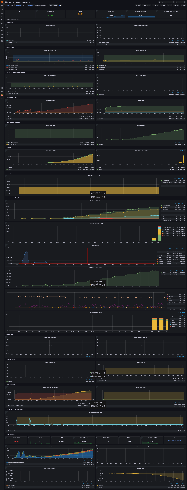

# A. summary

## 1. read optimization의 핵심

결국 caching을 통해 disk i/o 최소화 하자는 게 핵심.

버퍼풀(cache) 사이즈 최대한으로 늘리고,\
버퍼풀 내에 불필요한 데이터가 안올라오게 해서 cache hit rate 99%+ 찍는걸 목표하고,\
disk 읽을 때 pk말고 커버링 인덱스 말고 그냥 인덱스 기준으로 읽으면 물리적으로 붙어있는 애들 통으로 가져오는게 아니라, random i/o 하는데, 이것도 줄이고.

## 2. write optimization의 핵심

느린 random i/o write를 어떻게서든 피하고,\
작업을 지연/병합(batch)하여 최대한 sequential i/o로 바꾸는 게 핵심

1. mvcc에 redo-log (disk random i/o write -> disk sequantial i/o write 후, 나중에 함)
2. change buffer (인덱스용 b+tree의 sk random i/o read 대신, ram에 쓰고 나중에 disk random i/o write함)
   ...가 핵심

주요 병목지점은 disk random i/o 이고,\
이걸 지금 당장 피하기 위해서 redo-log로 disk에 sequential write하고(그래도 disk random i/o write보다 훨씬 빠름),\
나중에 쌓이면 redo-sequantial-log-on-disk -> 원래 데이터가 있는 페이지에 random i/o 하는 것

change buffer는 업데이트하는 필드가 인덱스 걸려있는데,\
버퍼풀에 해당 인덱스의 페이지가 안올라온 경우,\
disk random i/o해서 불러와서 쓰지 말고,\
일단 RAM에 써놓고 썼다 치고 나중에 여유생기면 disk random i/o로 쓰는 것.

# B. how read works in b+tree based RDB?


## --- 1. application layer ---

### step1. sql query -> connection pool
- 백엔드에서 쿼리 요청하는데 스레드 풀에 담긴 스레드 하나가 rdb에서 연결 담당하는 스레드풀에 rds-connection용 스레드랑 통신함. 쿼리 넘겨줌.
- PMM metrics에 `com_set_options`이 idle thread in thread pool에 요청 날리는 것. 아니면 부하 더 많아져서 thread 늘려야 한다는 요청 날리는거나.

## --- 2. query processing layer ---

### step2. query caching
- 쿼리가 캐싱되어있는지 확인하고 캐싱되있으면 값 바로 반환
- mysql 5.7까지만 했었고, mysql 8.0 이후로는 삭제됨
- 테이블 데이터가 단 한 줄이라도 변경되면 그 테이블과 관련된 캐시를 모두 삭제(invalidation)해야 했기 때문입니다. 이로 인해 쓰기 작업이 빈번한 환경에서는 캐시를 유지하는 비용이 더 커져 성능 저하의 원인이 되었습니다.
- 쿼리 캐싱은 옛날방식. sql 쿼리 + 그 결과를 메모리에 그대로 저장하는건데, 테이블에 write하면 얘도 삭제했어야 했어서 비효율이어서 없어졌잖아?
- InnoDB bufferpool(현대 방식): 쿼리 결과가 아닌, 디스크의 데이터와 인덱스 페이지(Page) 자체를 메모리에 캐싱합니다. 어떤 쿼리가 들어오든 필요한 데이터/인덱스 페이지가 버퍼 풀에 있다면 디스크를 읽지 않고 메모리에서 바로 처리합니다. 이것이 훨씬 효율적이고 재사용성이 높습니다.
- db read optimize를 할 때 개발자나 DBA가 가장 중요하게 여기는 설정은 바로 이 innodb_buffer_pool_size입니다. 보통 RDS RAM 메모리의 50~70%까지 설정하여 디스크 I/O를 최소화하는 것을 목표로 합니다.
### step3. parser
- 파서가 쿼리를 파싱함 하여 select, from, where의 계층적 tree로 만듬.
- sql 문법 에러 있으면 여기서 바로 return

### step4. query optimizer & execution plan
- 옵티마이저한테 쿼리를 넘겨주면, 어떤 방식,순서로 쿼리해야 가장 효과적인지 roadmap을 짜서 cost가 가장 낮은 애를 고름
- index
  - 그게 인덱스 안타는 full scan, 인덱스 타는거(equal, range, 등), 복합 인덱스, 같은 인덱스도 unique / hash / text-based 다 다름.
  - 복합인덱스는 where 조건1 && 조건2일때걸고, 필터링 더 잘하는쪽을 앞에두는게 유리. nested loop join과원리 같음.
  - Extra 필드에 Using filesort, Using temporary가 뜨지 않도록 쿼리나 인덱스를 수정합니다.
- join
  - join할 때 테이블 join 순서(사이즈가 작은 테이블이 큰 테이블을 join거는 쪽으로, 왜냐면 nested loop join에 2중 for문에서 driving table 에 N값이 적고, 걸 때 인덱스 타면 그나마 빨라서)
  - 어떤 join할지(nested join, sort merge join, hash join)
    - join 선정 기준
      - 테이블 크기: 조인할 테이블의 행(Row) 수가 얼마나 많은가?
      - 인덱스 유무: 조인에 사용될 컬럼에 인덱스(Index)가 있는가?
      - 데이터 분포: 조인 키 값이 얼마나 넓게 퍼져있는가?
      - 메모리 크기: 정렬이나 해시 테이블 생성에 사용할 수 있는 메모리가 충분한가?
    - Nested Loop Join
      - 2중 for loop이라고 보면 됨
      - 바깥 테이블이 매우작고, 안쪽 테이블에 인덱스가 걸려있을 때 쓴다.
      - 대신 두 테이블 모두 엄청 크거나, 안쪽 테이블에 인덱스 안걸려있으면 성능 느려짐
    - Sort Merge Join
      - 두 테이블 sort 후, merge
      - 두 테이블 둘 다 클 때 씀. join 컬럼에 적절한 인덱스가 없을 때 씀. 조인 결과가 정렬된 상태이어야 할 때 씀.
      - hash join처럼 대용량 메모리 필요없는 장점이 있음.
      - 근데 초기에 두 테이블 정렬할 때 cpu usage 튈 수 있다.
    - Hash Join
      - 메모리에 해시 테이블이라는 빠른 '조회용 테이블'을 만들어 사용합니다.
      - step1) 두 테이블 중 더 작은 테이블을 읽어, 조인 키를 해시 키로 사용하는 해시 테이블을 메모리에 생성합니다.
      - step2)더 큰 테이블을 한 줄씩 읽으면서, 조인 키를 똑같이 해시 함수에 넣어 메모리에 있는 해시 테이블을 **탐색(probe)** 하고, 일치하는 데이터를 찾아 조인합니다. (hash 탐색 O(1))
      - 보통 두 테이블 모두 큰데, 메모리 빵빵하고, join 조건이 "="일 때(<, >때 사용 불가), 그리고 join 컬럼에 인덱스가 없을 때 사용.
  - 경우의수 4 _ 3 _ 3 = 36가지라고 치면, 그중에서 제일 cost 낮은 쿼리를 고름
- cardinality 예측해서 full scan vs 인덱스 탈지 정한다.
  - 옵티마이저가 가장 중요하게 보는 통계 정보는 카디널리티(Cardinality), 즉 특정 컬럼에 얼마나 다양한 값이 분포하는가입니다.
  - WHERE name = '김철수' 조건이 있을 때, 옵티마이저는 "과연 '김철수'라는 이름을 가진 데이터가 몇 건이나 될까?"를 예측해야 합니다. 이 예측된 행 수를 기반으로 인덱스를 탈지, 풀 스캔을 할지 결정하기 때문입니다.
  - ex) 성별 M,F 은 카디널리티가 50%니까, 걍 풀스캔하자! vs email='hello@gmail.com'은 1개뿐이니까, 인덱스 타자!
- cardinality 예측의 한계
  - 이 예측을 위해 옵티마이저는 **히스토그램(Histogram)** 을 사용합니다. 히스토그램은 컬럼의 데이터 분포를 막대그래프처럼 구간별로 나누어 저장한 정보입니다.
  - 근데 이 histogram이 전체 데이터 기반으로 만들어지지 않고, 몇개만 샘플 떠서 만들어짐.
  - 따라서 샘플링된 데이터가 실제 데이터 분포랑 다른 경우, 옵티마이저의 카티널리티 예측이 크게 빗나갈 수 있음. 예를 들어, 옵티마이저는 10건을 예상하고 인덱스를 사용했지만 실제로는 100만 건이 조회되어 오히려 풀 스캔보다 훨씬 느려지는 최악의 실행 계획이 선택될 수 있습니다.
  - ex. '도시'컬럼에 인덱스가 걸려있는데, 옵티마이저는 도시가 다양하다고 생각해서 카디널리티가 높다고 착각하겠지만, 서울90% -> 깜짝?!
  -      그러면 '도시'컬럼을 인덱스 타는데, 사실 full scan이 훨씬 빠르지.
- join 순서
  - 일반적으로 join할 떄 hash join, merge sort join말고 nested loop join(O(N^2))하는데, 반복문 횟수를 최대한 줄이고 싶어함 옵티마이저가
  - 그래서 driving table쪽이 최대한 row가 필터링 되서 적은 쪽이 좋음. 왜냐면 join 거는 테이블에 where id = pk같은거 하면, 매 row마다 O(logN)이니까, 뒤에꺼가 더 빠름.
  - 예를들어, 회원(1억 row) join 우수회원(100 row) 한다고 했을 때,
  - 우수회원 join 회원이면, loop 100번동안, 회원 테이블에 pk 기준으로 찾는건데, 이게 loop 1억번동안, 우수회원 테이블 fullscan(or pk 기준으로 찾기)보다 빠름.
- hint
  - query에 hint있으면 참고하는 편이나, 현대 optimizer가 굉장히 발달했기 때문에, hint는 엄청 확실하고 엄청 성능 요하고 엄청 안바뀌는 금융코드 아니면 박지마

## --- 3. storage engine layer ----

### step5. buffer pool
- InnoDB는 가장 먼저 버퍼풀을 확인해서, 만약에 페이지가 버퍼풀에 캐싱되어 있었다면, disk i/o없이 순수 메모리 내에서 b+tree 탐색이 일어남.
- cache hit!
  - 버퍼 힛! 이게 젤 빠른 시나리오.
  - buffer pool의 cache hit 99%이상 목표해야 하고, 낮아지면 full scans이 버퍼풀 오염시키는지 확인해야 함.
- 버퍼풀 안에 원본 데이터 있는 b+tree랑 인덱스 데이터 담긴 b+tree가 있음
  - Q. 만약 인덱스 탄다고 하면, 인덱스 컬럼이 있는 b+tree로 leafnode에 실제 데이터의 위치를 파악하고, 여기서 헤깔리는부분인데, 이 실제 데이터의 위치를 가지고 바로 clustering index(b+tree인데 pk가 키고, leaf node에 실제 데이터가 있는 것)
  - A. index건 컬럼이 든 b+tree의 leaf node에 목적하는 데이터의 pk가 들어있는데, 이걸 가지고 다시 clustering index b+tree에 서치해서 leaf node에서 원본 데이터 가져감
- Adaptive Hash Index, AHI
  - 인덱스가 담긴 b+tree도 O(logN)인데, 이걸 더 빠르게 하기 위해 존재하는 인덱스 전용 자료구조
  - 특정 페이지가 자주 검색되는걸 발견하면,(ex. 동일한 where조건 쿼리가 자주 실행됨) -> 그 페이지에 대한 해시 인덱스를 버퍼 풀 안에 자동 생성
  - 이 해시 인덱스는 (인덱스 키 값, 데이터 페이지 메모리 주소) 쌍으로 구성됨
  - 이제 자주 반복되는 쿼리가 인덱스 타면, O(logN)으로 2번 하는게 아니라, O(1)으로 찾음
  - 원래 저 해시테이블이 없었으면, 인덱스가 담긴 b+tree한번 타고 리프노드에서pk값 얻은 다음에, 원본데이터가 있는 b+tree 한번 더 타서 O(logN) 2번 했을텐데, 자주 쿼리되어 AHI에 캐싱되었다면, O(1)으로 바로 페이지의 주소를 얻는 거니까, 원본 데이터의 b+Tree 한번만 타면 끝
- 페이지와 random I/O
  - 원본 b+tree(pk : 원본 데이터가 담긴 페이지의 주소)랑, name필드에 건 인덱스용 b+tree(알파벳 순 정렬된 name : pk) 이 두 b+tree안에 leaf node들이 16kb 페이지 단위로 끊어서 페이지에 저장됨.
  - 이 페이지를 버퍼풀에 로드해와서 페이지 안에 clutering index, 인덱스용 b+tree를 쓰는 것.
  - 인덱스용 b+tree에 값들은 정렬되서 비슷한 애들끼리 있겠지 이렇게.
    - 101호: ('Gildong', 본관 105호)
    - 102호: ('Gimin', 본관 32호)
    - 103호: ('Gisoo', 본관 512호)
  - 근데 이 pk값을 가지고 clutering index의 leafnode에서 원본데이터가 위치한 페이지의 주소값을 보면, 죄다 다른곳에 위치하겠지.
    - ...
    - 32호: (id: 32, name: 'Gimin', age: 25, ...)
    - ...
    - 105호: (id: 105, name: 'Gildong', age: 30, ...)
    - ...
    - 512호: (id: 512, name: 'Gisoo', age: 40, ...)
    - ...
  - 이 물리적으로 떨어져있는 데이터를 찾는게 random I/O이고, 이게 인덱스 타는 쿼리의 성능저하의 주요 원인(pk fullscan 대비)
  - 그래서 이 random I/O 피하려고,
    1. pk기반 풀스캔 하거나
      - 테이블 사이즈가 작을 때, 물리적으로 모여있으니까 아싸리 다 가져오는게 더 빠른 경우,
      - 카디널리티가 낮은 컬럼에 index용 b+tree타고 원본데이터용 b+Tree 타고 random i/o까지 하느니, 물리적으로 모여있는애 순차read 하겠다
    2. pk 기반 범위검색, range scan 하거나, (WHERE id BETWEEN 1000 AND 1100과)
    3. covering index를 하거나 (보조 인덱스 b+tree만 읽고 작업 끝냄. clustering index까지 안감 + random i/o 안해서 빠름)
- 버퍼풀 오염?
  - 자주 쿼리되던 인덱스용 b+tree와 clustering index가 버퍼풀에 로드되서 disk i/o 안하고 메모리 내에서만 read하는데,
  - 갑자기 뭐 유저 테이블 100만 rows fulls can한다고 하면, 얘를 다 disk i/o 해와서 버퍼풀 메모리에 올리는데,
  - 버퍼풀 메모리가 한정되있다보니 LRU같은 걸로 원래 쓰이던 애들 밀어내고 딱 한번만 쓰고 말 유저 테이블 풀스캔 데이터를 버퍼풀 메모리에 올려버림
  - 그러면 또 자주 쿼리되는거 요청 오면 cache miss 떠서, 다시 disk i/o해서 불러오고 메모리 로드해야 함.
  - 근데 맨 처음엔 disk i/o해서 불러오는게 인덱스 b+tree랑 원본 b+tree인데, 얘 타서 페이지 주소값 얻어도, 얘도 아까 100만건 full scan으로 밀려났기 문에, 다시 disk i/o 해서 가져와서 버퍼풀에 올려야 함.
  - 이래서 잘 안쓰는 쿼리 full scan이면 안좋나보다.

## --- 4. disk layer ---

### step6. buffer pool cache miss -> disk i/o
   - buffer pool에 cache miss나면, InnoDB는 디스크로부터 해당 page 읽어오라고 파일 시스템에 요청함
   - os는 먼저 파일 시스템 캐시를 확인하고, 없으면 물리디스크에서 접근함.
   - hardware layer에서 SDD/HDD가 디스크의 특정 sector에 접근하여 page가 포함된 block을 읽어 RAM에 전송함.
   - 읽어온 페이지는 버퍼 풀의 빈 공간(Frame)에 적재되고, LRU 리스트 같은 자료구조가 업데이트됩니다. 이제 해당 페이지는 버퍼 풀에 있으므로, 중단됐던 메모리 내 탐색 과정을 재개합니다.

### step7. MVCC && transaction && isolation && Locking(beta) for concurrency control 
   - what
     - Step 5와 Step 6을 통해 InnoDB가 물리적으로 데이터가 담긴 페이지를 찾아 메모리(버퍼 풀)에 올리는 데 성공했다고 가정해 봅시다.
     - 이제 Step 7에서 할 일은 그 페이지에 있는 데이터를 클라이언트에게 바로 반환하는 것이 아니라, **"현재 트랜잭션이 이 데이터를 보는 것이 허용되는가?"** 를 판단하는 것입니다. 이 가시성(Visibility) 판단 과정에서 MVCC와 격리 수준(Isolation Level)이 핵심적인 역할을 합니다.
   - MVCC란?
     - "읽기는 쓰기를 막지 않고, 쓰기는 읽기를 막지 않는다" (write의 lock이 read의 동시요청 막지 않게 하기위해 태어난 기술) 
     - multi version concurrency control
     - 한개에 row에 대해 여러 write, read요청이 각각의 transaction 만들어서 올 때, 같은 row에 대해 lock걸어서 동시성 떨어뜨리지 말고(serialzable from isolation), isolation level에 맞춰서 transaction 거는 시점에 스냅샷을 떠서 undo/redo log에 쓰고, 그걸 read하는 것. 원본 row는 따로 lock없이 write하고. 
     - 물론 같은 row에 대해 2개 이상의 write요청이 오면 beta lock을 걸겠지만, read에는 lock을 안걸고 동시에 읽어서 빠름. 
   - Isolation level
     - what 
        - 여러 요청이 각각 다른 시점에서 transaction거는데, mvcc에서 스냅샷(redo/undo log)를 어느시점에 뜰건지 정하는 것. 
        - READ UNCOMMITTED같은 경우엔 스냅샷을 안떠버려서, tx1가 read = 100 후에 tx2가 write=200 후에 다시 tx1.read 하면 200읽힘. 심지어 tx2.write() 후에 commit안했는데도(그래서 READ UNCOMMITTED) 같은 트랜젝션 내에 같은값 2번 읽으면 값이 달라짐 
        - READ COMMITTED의 경우엔, 스냅샷 뜨는 기준이 'select 문이 실행할 때마다'라 같은 상황에서 tx2가 write=200후 커밋 해버리면(READ 'COMITTED'), 같은 select문 안에서 읽으면 처음엔 tx1.read = 100하던게 tx1.read = 200이 됨 
        - REPEATABLE_READ의 경우엔 transaction 시작할 때 스냅샷을 뜨기 때문에, tx1.read = 100 후에 tx2나 tx3가 write=200 후 커밋까지 한다고 하더라도, tx1.read=100함. 왜냐면 트랜젝션 내내 초기에 떳던 스냅샷을 계속 참조하기 때문.
        - SERIALIZABLE은 동시성 처리라기 보다는 강제로 순차처리화 시키는 것. read, write 전부. 그래서 데이터의 일관성은 완벽히 보장되나 동시성이 매우 크게 떨어짐.
     - errors related to '데이터 정합성'
       1. dirty read: 커밋도 안된 데이터 읽어버림
       2. non-repeatable read: 한 트랜젝션 내에 같은 row 두번 읽었는데 결과가 다름
       3. phantom read: 한 트랜젝션 내에 같은 범위로 2번 쿼리했는데, 없던 '유령' row가 생겨남

### step8. return data

# C. how write works in b+tree based RDB?

## a. 핵심
goal: avoid disk random i/o

Redo Log(sequantial write on disk) && change buffer(write on RAM fast)같이 

RAM에 잠깐 써두거나, disk sequential I/o write 를 먼저 한 후에, 나중에 옮기자! 


---
1. Undo Log 기록: 데이터를 변경하기 전에, 롤백과 MVCC를 위해 기존 데이터를 **언두 로그(Undo Log)** 에 기록합니다.
2. Redo Log 기록 (순차 쓰기): 변경된 내용을 디스크에 직접 쓰지 않고, 어떤 페이지의 어떤 데이터를 어떻게 바꿨다는 변경 기록을 Redo Log Buffer(메모리)에 저장합니다. 이 과정은 순차(Sequential) 쓰기이므로 매우 빠릅니다. 트랜잭션이 커밋되면 이 Redo Log Buffer의 내용을 Redo Log File(디스크)에 순차적으로 기록합니다. 이것이 시스템 장애 시 복구를 보장하는 핵심입니다.
  - 2-1. 즉시 응답: Redo Log가 디스크에 기록(Flush)되면, 트랜잭션이 성공적으로 완료된 것으로 간주하고 클라이언트에게 응답을 보냅니다. 실제 데이터 파일에 변경된 내용이 즉시 반영된 것은 아닙니다.
  - 2-2. 백그라운드 플러싱: 이후 InnoDB의 백그라운드 스레드가 여유로울 때, 버퍼 풀에 있는 더티 페이지(변경된 데이터 페이지)들과 Change Buffer에 쌓인 변경사항들을 디스크에 있는 실제 데이터 파일과 인덱스 파일에 일괄적으로(Batch) 반영합니다. 이 과정에서 Random I/O가 발생하지만, 트랜잭션 처리 속도와는 무관하므로 사용자 경험에 영향을 주지 않습니다.
3. Change Buffer 기록 (보조 인덱스 최적화): UPDATE나 INSERT로 인해 보조 인덱스(Secondary Index)를 수정해야 할 때, 해당 인덱스 페이지가 버퍼 풀에 없는 경우 디스크에서 읽어오는 Random I/O를 수행하지 않습니다. 대신, "나중에 이 인덱스를 이렇게 바꿔달라"는 요청을 Change Buffer(메모리)에 기록하고 즉시 작업을 마칩니다.

## b. step by step

`UPDATE my_table SET name = '김영희' WHERE id = 123;` 라고 가정,

read랑 steps들이 optimizer 단계까지는 같음.\
근데 그 이후에 storage engine -> hardware disk i/o단계가 다름.\
read의 핵심이 '캐시에서 찾기'라면, Write의 핵심은 '일단 로그에 기록하고, 실제 쓰기 작업은 나중에'이기 때문

Redo Log와 Change Buffer는 느린 디스크 쓰기 작업을 사용자(클라이언트)가 기다리지 않도록 하기 위해,\
스토리지 엔진 내부에서 "일단 로그에만 기록하고(Redo Log),\
변경점은 메모리에 적어뒀다가(Change Buffer),\
나중에 한꺼번에 처리하는" 고도로 최적화된 메커니즘입니다.

### b-1. storage engine layer

- Step 5-1: 데이터 페이지를 버퍼 풀로 로드 및 수정
  - Read와 마찬가지로, id=123 로우가 담긴 데이터 페이지를 버퍼 풀에서 찾거나, 없다면 디스크에서 읽어옵니다.
  - 그러니까 페이지를 버퍼풀에 올린 다음에, 값을 바꿔버리면 dirty page되니까, 원본데이터를 undo-log(rollback, mvcc 목적)에 먼저 저장한다음 값을 바꾸고, (5-2에서 이어짐)
- Step 5-2: MVCC에 Redo Log 기록 (중요!)
  - 값을 바꿨을 때, 정확히 어떤 페이지에 어떤 라인에 데이터를 뭐로 바꿨다를 redo-log-buffer에 저장해서 sequentially하게 ram에 기록하고, commit 시점에 이 Redo Log 버퍼 내용을 redo-log-file disk에 "순차"저장함.
  - 그리고 disk에 쓴 redo-log-file이 나중에 어느정도 쌓이면 한번에 배치로 disk i/o write하는 것. 이 땐 random i/o를 해서 훨씬 느림
  - 결국 write이 빨라진건, random i/o를 나중에 하고, 지금 당장은 disk i/o를 하긴 하는데, sequential write여서 이게 훨씬 빠르니까, 이걸로 일단 떔빵해서 빠른 것.
- Step 5-3: 체인지 버퍼(Change Buffer) 기록 (중요!)
  - change buffer는 보조 인덱스 전용
  - example
    1. `UPDATE users SET name = '김영희' WHERE id = 105;` (name 컬럼에 보조 인덱스가 있다고 가정)
    2. id=105인 원본 데이터 페이지를 버퍼 풀에 올리고 '김영희'로 수정합니다 (Dirty Page가 됨).
    3. 이 변경 내역을 리두 로그에 기록합니다.
    4. 이제 name 인덱스를 수정해야 합니다.
       - CASE A: name 인덱스 페이지가 버퍼 풀에 있는 경우
         - 그냥 버퍼 풀에서 해당 인덱스 페이지를 바로 수정합니다. (이 페이지도 Dirty Page가 됨)
       - CASE B: name 인덱스 페이지가 버퍼 풀에 없는 경우 (핵심!)
         - 디스크에서 읽어오는 Random I/O를 하지 않고, "나중에 id=105의 name 인덱스를 '김영희'로 바꿔줘" 라는 변경 내용을 **체인지 버퍼(메모리)** 에 기록하고 작업을 끝냅니다.
    - 결론: 체인지 버퍼는 보조 인덱스 업데이트 시 발생하는 Random I/O를 피하기 위해 변경 내용을 잠시 메모리에 저장해두는 '메모장' 같은 역할을 하는 것입니다.
...

- Step 8: 클라이언트에 응답
  - 리두 로그가 디스크에 기록되면, 실제 데이터 파일 쓰기와 상관없이 트랜잭션은 성공적으로 완료되고 클라이언트는 응답을 받습니다.
- Step 9: 백그라운드 플러싱 (Flushing)
  - 이후 InnoDB의 백그라운드 스레드가 여유로울 때, 버퍼 풀에 있는 '더티 페이지'들을 실제 데이터 파일에 기록하고, '체인지 버퍼'에 쌓인 변경점들을 인덱스 파일에 반영합니다.

### b-2. hardware disk i/o layer

# D. 실제 100~800RPS 테스트의 ec2 & RDS APM

## a. RDS의 APM metrics



### a-1. PMM 중요 metrics

- 주요지표
  - QPS (query per second)
    - select, update, insert, delete 가 쿼리가 몇번 수행되는지 (쿼리 하나에 여러개 N개 있어도 N개로 침. 물리적인 쿼리 run한 양)
  - TPS (transaction per second)
    - 쿼리 다 실행하고 commit 한 횟수. 논리적인 작업 성공률. 1비즈니스 로직 = 1 TPS라고 봐도 무방할 듯.
  - Buffer Pool Hit Rate
    - DB read성능의 가장 핵심적인 지표. 보통 cache hit rate 99%이상을 목표로 함.
    - cache hit 99% 아래면, 버퍼풀 늘리거나, 인덱스 안타는 풀스캔 쿼리가 많다는 뜻이므로(풀스캔 한 잘 안읽는 page를 buffer pool에 넣는 것)
  - Buffer pool usage
    - 버퍼 풀 사용량
    - 사용량이 100%에 가깝다면 늘려줘야 되는 시기.
    - 보통 RDS RAM에 50% ~ 70% 까지 할당함
  - CPU usage
    - ec2는 cpu usage가 한 70~80%가 적절하고, db는 40%~70% 유지가 적절
- === MySQL Instance Summary (상단) ===
  - QPS (Queries Per Second): 초당 처리되는 쿼리 수. 데이터베이스가 얼마나 많은 작업을 처리하는지 보여주는 핵심 부하 지표입니다.
  - InnoDB Buffer Pool: InnoDB 엔진이 사용하는 메모리 캐시의 총 크기(2.19 G)를 보여줍니다.
  - MySQL Connections: 현재 연결된 클라이언트의 수입니다.
- === thread pool connections ===
  - MySQL Client Thread Activity:
    - Threads_running: 현재 활발하게 쿼리를 실행 중인 스레드의 수입니다.
    - Threads_connected: 현재 연결된 총 스레드 수입니다.
- === query related ===
  - Frequency Histograms & Slow Queries:
    - Com\_... (select, insert, update, delete 등): 실행된 쿼리의 유형별 비율을 보여줍니다. 워크로드가 읽기 중심인지 쓰기 중심인지 파악할 수 있습니다.
    - MySQL Slow Queries: long_query_time 설정값을 초과한 느린 쿼리의 수를 보여줍니다.
  - Select Types & Sorts
    - 어떤 종류의 SELECT 쿼리가 실행되었는지, 정렬(Sort) 작업이 어떻게 수행되었는지를 보여줍니다.
    - Select_full_join: JOIN 시 양쪽 테이블 모두에서 풀 스캔이 발생했음을 의미합니다. 인덱스가 전혀 사용되지 않는 최악의 조인 방식입니다
    - Sort_merge_passes: 정렬할 데이터가 너무 많아 메모리(sort buffer)에 담지 못하고, 임시 디스크 공간을 사용해 여러 번에 걸쳐 정렬(merge sort)했음을 의미합니다
    - Select_full_join이나 Sort_merge_passes 수치가 높게 나타난다면, 이는 인덱스 설계가 잘못되었거나 매우 비효율적인 쿼리가 실행되고 있다는 강력한 증거입니다. 특히 Sort_merge_passes는 디스크 I/O를 유발하므로 반드시 해결해야 할 문제입니다
  - Table Locks & Questions
    - Table_locks_waited: 테이블 레벨 락(Lock)을 얻기 위해 대기한 횟수입니다.
    - Table_locks_immediate: 대기 없이 즉시 테이블 락을 얻은 횟수입니다.
    - Questions: 클라이언트가 서버로 보낸 총 요청(쿼리) 수입니다.
    - Table_locks_waited 수치가 높다면 테이블 레벨에서 심각한 경합(Contention)이 발생하고 있다는 의미입니다. 주로 MyISAM 스토리지 엔진을 사용하거나, 트랜잭션 중 명시적으로 테이블을 잠글 때 발생하며 병목 현상의 직접적인 원인이 됩니다.
- === network ===
  - mysql network traffic
    - 네트워크가 병목되는 경우는 드물긴 한데, 대용량 데이터 한번에 전송하는 배치작업할 때나 주요하게 봐야하는 메트릭
  - mysql network usage hourly
- === mysql internals ===
  - mysql internal memory overview
    - 여기서 시스템 전체 RDS에 부여된 메모리가 4gib인데, buffer pool에 할당된 메모리가 2gib를 확인할 수 있다.
  - top command counters
    - set_option, select, commit, insert, update 의 비율이 어떻게 되는지 보여준다.
    - Q. com_set_option이 제일 비율이 높은데, (그 다음은 select) 얘는 query에서 어떤 부분인거지?
    - A. Com_set_option은 실제 SELECT나 INSERT 같은 데이터 조작 쿼리가 아니라, 데이터베이스 연결(Connection)이 생성되거나 초기화될 때 호출되는 내부 설정 명령어. 부하가 늘어서 connection pool에서 새 커넥션 만들 때 호출됨 + idle 상태였던 connection 깨울 때 호출됨. 부하테스트에 RPS가 높다면 이 수치가 높은게 당연한 것.
  - mysql handlers
    - MySQL이 스토리지 엔진 레벨에서 데이터를 어떻게 읽고 쓰는지를 보여주는 저수준(low-level) 카운터입니다.
    - `Handler_read_rnd_next`: 데이터 파일의 처음부터 끝까지 순차적으로 읽은 횟수입니다. 풀 테이블 스캔의 전형적인 지표입니다.
    - `Handler_read_next`: 인덱스 순서에 따라 다음 데이터를 읽은 횟수입니다. (좋음, 인덱스 레인지 스캔)
    - `Handler_read_key`: 인덱스를 통해 정확한 위치의 데이터를 찾은 횟수입니다. (좋음)
    - Handler_read_rnd_next 수치가 Handler_read_key나 Handler_read_next에 비해 비정상적으로 높다면, 인덱스를 타지 못하는 쿼리가 많다는 확실한 증거입니다. EXPLAIN의 type: ALL과 같은 의미를 갖습니다.
  - mysql transaction handlers
    - 스토리지 엔진 레벨에서 트랜잭션이 어떻게 처리되고 있는지를 보여주는 카운터
    - `Handler_commit`: 트랜잭션이 성공적으로 완료되어 커밋(Commit)된 횟수입니다.
      - 정상 상태 확인: 일반적으로 Handler_commit 수치가 꾸준히 증가하는 것이 정상입니다. 이는 작업들이 성공적으로 데이터베이스에 반영되고 있음을 의미합니다.
    - `Handler_rollback`: 트랜잭션이 실패하거나 명시적으로 취소되어 롤백(Rollback)된 횟수입니다.
      - Handler_rollback 수치가 예상치 못하게 높다면, 애플리케이션 로직에 문제가 있거나, 데드락(Deadlock)이 발생했거나, 제약 조건 위반 등으로 인해 트랜잭션이 계속 실패하고 있다는 강력한 신호입니다. 즉시 원인을 파악하고 해결해야 합니다.
    - `Handler_savepoint`: 트랜잭션 내에서 SAVEPOINT가 설정된 횟수입니다.
    - `Handler_savepoint_rollback`: SAVEPOINT로 롤백된 횟수입니다
  - process state
    - SHOW FULL PROCESSLIST 명령의 결과를 시각화한 것으로, 각 스레드가 현재 어떤 상태에 있는지를 보여줍니다.
    - Threads_running이 높을 때, 스레드들이 구체적으로 어떤 상태(State 컬럼)에서 시간을 보내는지 파악할 수 있습니다. 예를 들어 Copying to tmp table, Sorting result, locked 등의 상태가 많이 보인다면, 이것이 바로 성능 저하의 원인입니다
  - query cache
    - 과거(mysql 5.8)에 사용되었던 쿼리 캐시 관련 지표입니다
    - mysql8.0 이후 부터는 항상 no data라고 나올 것.
- === disk level ===
  - mysql file openings
  - mysql open files
  - mysql table open cache status
    - 의미: 테이블을 열 때 테이블 캐시를 얼마나 효율적으로 사용했는지를 보여줍니다.
    - Opened_tables: 테이블 캐시에 없어 디스크에서 직접 테이블 정의 파일을 열어야 했던 횟수입니다.
    - Opened_tables 수치가 지속적으로 빠르게 증가한다면, table_open_cache와 table_definition_cache 설정값이 작다는 의미일 수 있습니다. 수천 개의 테이블을 사용하는 대규모 환경에서는 이 캐시 크기를 튜닝하는 것이 중요할 수 있습니다
  - mysql open tables
  - mysql table definition cache
- === 추가해야할 메트릭 ===
  - InnoDB Buffer Pool Hit Rate
    - 얼마나 많은 데이터 읽기를 디스크가 아닌 메모리(버퍼 풀)에서 처리했는지 보여주는 핵심 지표입니다. 99% 이상을 목표로 합니다
    - 보통 innodb_buffer_pool_size 사이즈를 늘려서 read 성능 개선한다.
    - 자주 사용되지는 않는데 full scan해서 용량만 많이 잡는 쿼리를 찾아 최적화 한다.
    - 공식: hit rate = (1 - `InnoDB Data Reads` / `InnoDB Buffer Pool Requests`) \* 100
      - `InnoDB Buffer Pool Requests`: 논리적 읽기 요청
        - 쿼리 처리를 위해 InnoDB가 데이터 페이지를 요청한 총 횟수입니다.
      - `InnoDB Data Reads`: 물리적 디스크 읽기
        - 요청된 페이지가 버퍼 풀에 없어 디스크에서 직접 읽어온 실패(Miss) 횟수입니다

# E. 대용량 데이터 핸들링

## a. 문제

하루 데이터 처리량 3000만건

통계페이지 만들기.
오늘매출 vs 어제 매출 vs 저번달 매출 비교 visualize

단, 하루 매출량이 3000만 rows

오늘날짜 매출량 쿼리 한번에 5분걸림 -> 10초로 줄임

쿼리 2만줄, 일주일동안 짬,
서브쿼리 여러번

### 1. 테이블 설계1 - read heavy vs write heavy

Read-heavy 테이블은 읽기(조회) 속도를 최우선으로, Write-heavy 테이블은 쓰기(입력, 수정, 삭제) 속도를 최우선으로 설계합니다.
두 방식은 인덱스 활용, 데이터 구조, 정규화 수준에서 명확한 차이를 보입니다.

#### 1-1. read heavy table 설계

read >>> write, update, delete

Read-heavy 테이블은 데이터 변경은 적고 조회가 압도적으로 많은 경우입니다. (예: 블로그 게시물, 상품 정보, 통계 데이터)

- 인덱스(Index)의 적극적 활용: WHERE 절이나 JOIN에 사용되는 거의 모든 컬럼에 인덱스를 생성합니다. 다양한 조회 조건에 맞춰 복합 인덱스도 적극적으로 활용합니다. 인덱스가 많아지면 쓰기 속도가 느려지지만, 읽기 속도가 극적으로 향상되므로 감수할 수 있습니다.
  - 특히 convering index가 사기다. 인덱스용 b+tree한번만 읽고 결과 반환하기 때문에 disk i/o 단계 자체를 스킵하기 때문.
- 비정규화(Denormalization): 조회 시 JOIN 연산을 줄이기 위해, 의도적으로 중복을 허용하여 여러 테이블에 흩어져 있는 데이터를 하나의 테이블에 합쳐 놓습니다. 예를 들어, user 테이블에 있는 user_name을 post 테이블에 post_writer_name으로 중복 저장하여 JOIN 없이 게시물과 작성자 이름을 함께 조회할 수 있도록 합니다.
- 캐싱(Caching) 전략: 자주 조회되지만 변경되지 않는 데이터는 Redis나 Memcached 같은 메모리 기반 캐시 시스템에 저장하여 데이터베이스의 부하를 줄이고 응답 속도를 높입니다.
- 요약 테이블(Summary Table) 사용: 대용량 데이터의 경우, 통계나 분석에 필요한 데이터를 미리 집계해 둔 별도의 요약 테이블을 만들어 원본 테이블 대신 요약 테이블을 조회하게 합니다.

#### 1-2. write heavy table 설계

write, update, delete >>> read

Write-heavy 테이블은 조회보다 데이터 입력, 수정, 삭제가 훨씬 빈번한 경우입니다. (예: 실시간 로그, 채팅 메시지, 주문/결제 데이터)

- 인덱스(Index) 최소화: 인덱스는 쓰기 작업의 가장 큰 부하 요인입니다. 데이터가 INSERT, UPDATE, DELETE 될 때마다 B-Tree 인덱스의 구조를 재정렬해야 하기 때문입니다. 따라서 조회를 위해 꼭 필요한 최소한의 인덱스(예: PK)만 유지하고, 나머지 인덱스는 과감히 제거합니다.
- 정규화(Normalization): 데이터 중복을 최소화하는 정규화 원칙을 철저히 지킵니다. 이는 한 번의 쓰기 작업이 여러 테이블에 영향을 미치지 않도록 하여 쓰기 작업의 범위를 줄이고 데이터 일관성을 보장합니다.
  - insert heavy한 경우엔 반정규화로 테이블 1개가 정규화로 테이블 여러개보다 더 유리할 수 있는데,
  - update, delete의 경우, 반정규화하면 모든 중복데이터를 여러테이블에 걸쳐서 수정 / 삭제해야해서 별로다. 또한 여러 테이블에 걸쳐 수정해야하는거라 lock이 좀 길어질 수 있다.
  - insert위주로 일어나는 write-heavy table이랑, insert + update & delete도 같이 일허나는 write-heavy table이랑 또 구분 가능하다. 후자는 수정/삭제시 부하와 락 범위를 최소화하는 정규화가 훨씬 더 유리한 설계
- 단순한 데이터 구조: 쓰기 작업 시 데이터 변환이나 복잡한 로직이 필요 없도록 테이블 구조와 데이터 타입을 최대한 단순하게 설계합니다.
- 파티셔닝(Partitioning): 하나의 거대한 테이블에 계속 쓰기 작업이 몰리면 병목 현상이 발생하므로, 날짜나 해시값 등을 기준으로 테이블을 물리적으로 분할하여 쓰기 부하를 분산시킵니다.
- Bulk Insert 활용: 여러 건의 INSERT를 한 번의 트랜잭션으로 묶어서 처리하는 Bulk Insert 방식을 사용하여 네트워크와 데이터베이스의 오버헤드를 줄입니다.

##### 1-2-1. write only heavy table인 경우

Bulk Insert를 위한 직접적인 접근 (LOAD DATA)
ORM의 편리함을 포기하고 성능을 극한으로 끌어올리는 방법입니다.

애플리케이션이 3천만 건의 데이터를 DB에 직접 INSERT 하는 대신, 빠른 로컬 디스크에 CSV 파일로 먼저 씁니다.

그 후, MySQL에 LOAD DATA LOCAL INFILE 명령어를 실행합니다.

이 명령어는 MySQL 클라이언트가 직접 CSV 파일을 읽어 서버로 전송하고, 서버는 SQL 처리 계층의 많은 부분을 건너뛰고 스토리지 엔진에 바로 데이터를 쓰기 때문에, JDBC를 통한 INSERT와는 비교할 수 없을 정도로 빠릅니다.

##### 1-2-2. write, update / delete가 골고루 있는(가끔 +read) write heavy table인 경우 -> CQRS

- CQRS
  1. read용 테이블과 write용 테이블 분리
  2. 쓰기 테이블은 쓰기 최적화 되어있고, 정규화 잘 되있는 상태. write, update, delete만 받음.
  3. 쓰기 다 끝났으면 kafka 메시지 -> 비정규화 + read optimization 된 read용 테이블에 내용 업데이트. (read는 join없으니 빠르다.)

정합성 좀 깨져도 되는 상황에서 쓸 듯

### 2. 테이블 설계2 - 확장성 고려

지금은 하루 3천만 건이지만, 앞으로 1억 건이 될 수도 있다는 가정하에 파티셔닝이나 정규화 수준 등을 "미리" 설계해야 나중에 구조를 뒤엎는 대참사를 막을 수 있습니다.

### 3. 테이블 설계3 - 데이터 무결성 FK

PK, FK 등 제약조건은 데이터의 정합성을 보장하는 중요한 기능이지만, 너무 과도하게 사용하면 쓰기 성능을 저하시킬 수 있습니다.

데이터의 중요도와 비즈니스 로직을 고려하여 적절한 수준의 제약조건을 설정하는 것이 중요합니다.

### 4. 트랜젝션을 얼마나 크게 혹은 잡게 잡을 것인가?
#### 4-1. transaction을 너무 잘게 쪼갰을 경우 (1건씩 commit)
- 핵심: `COMMIT` is expensive. why?
  - `commit` is synchronous operation that triggers several resource-intensive tasks
    1. Redo Log Flushing: The Redo Log Buffer must be flushed to the Redo Log File on the disk. This is a slow, synchronous disk I/O.
    2. Locking Overhead: The transaction's locks must be acquired and then released. Even if they're row-level, this has a cost.
      - 근데 이건 lock이 InnoDB는 row level 단위로 걸려서 10000 row insert를 1번에 tx안에서 하던 10번에 tx에 걸쳐서 하던 number of row level lock은 같음 
    3. Context Switching: The database has to manage the state change of a transaction completing, which involves CPU cycles.
  - and 1 tx = 1 commit -> more tx, more commit 
- 오버헤드(Overhead) 증가: 매 COMMIT은 MySQL에 큰 부담을 줍니다.
  - 로그 파일 동기화: COMMIT 시점에는 Redo Log를 디스크에 강제로 동기화(Flush)하는 작업이 발생합니다. 1만 건을 1만 번 커밋하면 이 느린 디스크 I/O 작업이 1만 번 반복됩니다.
  - 락(Lock) 오버헤드: COMMIT 시에만 락이 해제되고 다시 획득되는 과정이 반복됩니다. 이는 불필요한 시스템 리소스 소모로 이어집니다.
- 결과: 개별 트랜잭션은 빠르지만, 전체적으로 보면 COMMIT 오버헤드가 누적되어 오히려 성능이 매우 떨어집니다.

##### 4-1-1. read & write 요청이 섞여있는 테이블이라면? -> transaction을 잘게 쪼개기 
- 문제: 3천만 건의 데이터를 한 번에 INSERT 하거나 UPDATE 하는 거대한 트랜잭션을 실행하면, 그 작업이 끝날 때까지 해당 테이블에 락(Lock)이 걸려 다른 작업들이 모두 대기해야 합니다. 이는 전체 시스템의 성능 저하로 이어집니다.
- 해결책: 거대한 작업을 1만 건씩 3000개의 작은 트랜잭션으로 쪼개서 처리합니다.
- 배치(Batch) 처리: 1만 건을 처리하고 **커밋(Commit)** 하여 락을 잠시 풀어줍니다.
- 효과: 다른 작업들이 중간중간 끼어들 수 있는 틈을 만들어 주어, 시스템 전체의 응답성을 유지할 수 있습니다. 또한, 작업 실패 시 전체를 롤백하는 대신 실패한 배치만 재처리하면 되므로 안정성도 높아집니다.


#### 4-2. transaction을 너무 길게 쪼갰을 경우 (100만 row를 하나의 transaction으로 묶은 경우)
- 락(Lock) 유지: 사용자께서 우려하신 대로, 거대한 트랜잭션은 배타적 락(Exclusive Lock)을 매우 오랫동안 유지합니다. 다른 작업이 들어올 수 없어 병목 현상이 발생합니다.
- 메모리 및 로그 부담: 하나의 트랜잭션이 크면 언두 로그(Undo Log)와 Redo 로그도 거대해집니다. 이는 버퍼 풀(Buffer Pool)의 메모리를 많이 차지하고, 롤백(Rollback)이 필요한 경우 막대한 시간이 소요될 수 있습니다.
- 결과: 시스템 응답성이 떨어지고, 트랜잭션 실패 시 복구 비용이 매우 큽니다.


##### commit은 비싸니까 commit 횟수를 줄여보자! 
commit 비용이 비쌈. 위에 써놓거와 같이. 
1tx = 1commit

그래서 commit 횟수 줄이려고 하는 테크닉들이 있음. 그것중 하나가 `batch insert`

 여러 행을 하나의 INSERT 문으로 묶어 보냅니다. 
 `INSERT INTO table (col1, col2) VALUES (val1, val2), (val3, val4), ...;` 와 같은 형식으로, 
 이게 `bulk insert`
 COMMIT 횟수와 네트워크 왕복 횟수를 줄여 오버헤드를 크게 낮출 수 있습니다.

##### `innodb_flush_log_at_trx_commit`
 이 변수는 COMMIT 시 Redo Log를 디스크에 동기화하는 방식을 결정합니다.

1. 1 (기본값): 매 커밋마다 디스크에 동기화하여 안정성이 높지만, 성능이 낮습니다.
2. 0 또는 2: 로그 동기화를 지연시켜 쓰기 성능을 높입니다. 데이터 유실 위험이 약간 있지만, 대용량 로그 파이프라인처럼 일부 데이터 손실이 허용되는 시나리오에서 성능을 극적으로 향상시킬 수 있습니다.


### 5. row-level-write-lock bypass 
10000 rows bulk insert한다고 했을 때, mysql innoDB기준, row 단위로 beta lock 건다. 
lock생성, 상태확인, 해제에 cpu usage쓰므로, 이 단계를 bypass하면 대규모 write 성능이 올라가지 않을까?

#### 팁1. **고유 인덱스(Unique Index)** 가 없는 테이블에 INSERT할 경우, 
...InnoDB는 락 관리 비용이 매우 낮은 특별한 락(Insert Intention Lock)을 사용합니다. 이는 다른 INSERT 작업과 충돌하지 않으므로 동시성 문제를 크게 줄입니다.


#### 팁2. `LOAD DATA INFILE` 
대량의 데이터를 MySQL에 입력하는 가장 효율적인 방법입니다. LOAD DATA 명령은 여러 개의 개별 INSERT 문을 사용하는 대신, 파일 전체를 하나의 작업으로 처리합니다

- 락(Lock) 최소화: 이 명령은 데이터 **삽입 중에는 테이블에 대한 metadata lock 정도만 짧게 유지** 하고, **대부분의 작업을 락 오버헤드 없이 진행** 합니다.
- 성능 극대화: SQL 파싱, 옵티마이저 계획 수립 등 여러 단계를 건너뛰고, 디스크 쓰기 작업을 최대한 효율적으로 처리하도록 설계되었습니다.

따라서 로그를 쌓는 데이터 파이프라인이라면, 개별 INSERT문을 반복해서 실행하는 대신, 데이터를 메모리나 임시 파일에 모아 두었다가 LOAD DATA INFILE을 주기적으로 실행하는 것이 가장 좋습니다.

#### Q. how `LOAD DATA INFILE` works?
내 언어 요약 

1. inline data infile 역시 디스크에 바로 쓰는게 아니라, redo log에 sequential write한 후에, 끝났다고 하고, 나중에 시스템이 저 redo log를 실제 테이블 데이터가 물리적으로 저장된 곳에 random i/o하는식인거네? 
2. 인덱스 만드는것도 change buffer(ram)에서 쓰기만 하고 일단 끝났다고 하고 나중에 mysql 시스템이 후처리하는 식인거네?

---
1. step1. 로드 전에 보조 인덱스를 비활성화(DISABLE KEYS)하고 로드 후에 다시 활성화(ENABLE KEYS)하는 것입니다. 
  - 이 방식은 인덱스 업데이트를 한 번에 효율적으로 처리하므로 성능을 극대화합니다.
  - 단, 수동으로 해야 함 
2. step2. 파일 읽기 및 트랜잭션 시작: 
  - MySQL 서버가 지정된 파일을 읽기 시작하고, 모든 데이터 로드를 하나의 트랜잭션으로 처리합니다. 
  - 이 과정에서 테이블에 단기적인 락을 걸어 메타데이터 변경을 막지만, 데이터 로드 자체에 대한 행(Row) 단위의 락은 최소화합니다.
3. 데이터 버퍼링: 
  - 파일을 한 줄씩 읽어 SQL 파싱을 거치지 않고, 데이터를 내부 메모리 버퍼에 쌓아둡니다. 
  - 이 방식은 개별 INSERT 문을 실행할 때 발생하는 네트워크 오버헤드와 SQL 파싱 비용을 제거하여 성능을 크게 향상시킵니다.
4. 로그 기록: 
  - 버퍼에 쌓인 데이터는 한 번에 묶여 **Redo Log** 에 기록됩니다. 
  - 이 과정은 순차적인 디스크 쓰기(Sequential Write)로 진행되어 매우 빠릅니다.
5. B-Tree 인덱스 업데이트:
  - 1차 인덱스(Primary Index): 데이터가 테이블에 삽입될 때, 1차 인덱스(B-Tree)도 함께 갱신됩니다. 이 과정은 디스크의 랜덤 접근(Random Access)을 필요로 하므로 I/O 오버헤드가 발생하지만, LOAD DATA는 이 작업을 최대한 효율적으로 처리합니다.
  - 보조 인덱스(Secondary Index): LOAD DATA INFILE의 진정한 강점은 보조 인덱스 처리 방식에 있습니다.
    - 옵션 1: ALTER TABLE ... DISABLE KEYS: 대량 로드 전에 DISABLE KEYS 명령을 실행하면, 보조 인덱스 업데이트를 잠시 중단시킬 수 있습니다.
    - 옵션 2: 내부 최적화: 명령어를 그대로 실행하면, LOAD DATA는 내부적으로 **체인지 버퍼(Change Buffer)** 를 활용하여 보조 인덱스 업데이트를 지연시킵니다. 디스크에 흩어져 있는 보조 인덱스 페이지를 모두 읽어와 업데이트하는 대신, 변경 내역을 메모리에 모아두었다가 백그라운드에서 한 번에 처리합니다.


### 6. 요약 테이블 (미리 계산해두기), read optimization 전용

핵심 개념: 사용자가 통계 페이지를 요청할 때마다 3천만 건의 원본(Raw) 데이터를 매번 집계하는 것은 매우 비효율적입니다. 따라서, 자주 사용하는 조건으로 미리 집계된 결과를 저장해 둘 별도의 테이블을 만드는 것입니다.

예시: '일별 상품 카테고리별 매출액'을 미리 계산해서 요약 테이블에 INSERT 해 둡니다. (날짜, 카테고리, 총매출액)

효과: 통계 페이지 쿼리는 이제 3천만 건이 아닌, 잘해야 수백 건밖에 안 되는 이 요약 테이블만 읽으면 됩니다. 쿼리 속도가 비교할 수 없을 정도로 빨라집니다.

Q. 그러면 원본 테이블이랑 요약 테이블이랑 같은 데이터 중복저장이니까, 정합성 깨질지도?

네, 정확한 지적입니다. 데이터 정합성 유지가 요약 테이블의 가장 큰 관리 포인트입니다. 해결 방법은 여러 가지가 있습니다.

1. 배치 잡 (Batch Job): 가장 일반적인 방법입니다. 매일 새벽처럼 사용량이 적은 시간에, 어제의 원본 데이터를 기준으로 오늘의 요약 테이블 데이터를 생성하고 기존 데이터를 덮어쓰거나 새로 추가하는 작업을 예약 실행합니다. (실시간 정합성은 아니지만, 통계 데이터에서는 허용되는 경우가 많습니다.)
2. 트리거 (Trigger): 원본 테이블에 데이터가 INSERT, UPDATE, DELETE 될 때마다, 관련된 요약 테이블의 데이터를 자동으로 즉시 수정하도록 트리거를 설정합니다. 실시간 정합성을 보장하지만, 원본 테이블의 쓰기 작업에 부하를 줄 수 있어 신중하게 사용해야 합니다.
3. 구체화된 뷰 (Materialized View): 일부 데이터베이스에서 지원하는 기능으로, 요약 쿼리 자체를 '뷰' 객체로 저장해두면 데이터베이스가 정해진 주기마다 자동으로 데이터를 동기화해주는, 배치 잡과 트리거의 장점을 합친 것과 같은 기능입니다.

### 7. 파티셔닝

논리적으로는 하나의 거대한 테이블이지만, 물리적으로는 조회 조건에 따라 여러 개의 작은 파일로 쪼개서 저장하는 기술

ex. WHERE 판매일자 = '2025-08-04' 라는 쿼리가 들어오면, 데이터베이스는 30억 건 전체를 뒤지는 것이 아니라, '2025-08-04' 데이터만 모여있는 특정 파티션(파일)만 읽습니다. 읽는 데이터의 양 자체가 줄어드니 속도가 극적으로 향상됩니다. 이것이 바로 "같은 날짜의 데이터는 같은 물리적 공간에 저장"하는 것의 의미입니다.

#### 7-1. 파티셔닝의 본질

결국 데이터 조회할 때 disk random i/o -> disk sequential read 로 바꾸는게 핵심. 물리적으로 모아져 있어야 read가 빠름.

근데 그러려면, 요청에 맞게 대용량 데이터를 오밀조밀 비슷한애들끼리 뭉쳐서 넣어야 한다.

하루 3천만건씩 데이터가 쌓이고, 나중에 날짜별로 데이터 read해야 한다면,
애초에 넣을 때, 날짜별로 partition 지정해줘서 넣음

#### 7-2. 원리

파티션 프루닝 (Partition Pruning)
이것이 파티셔닝 성능 향상의 전부라고 해도 과언이 아닙니다. 옵티마이저는 쿼리의 WHERE 절을 보고, 조회에 필요 없는 파티션은 아예 읽지 않고 건너뛰는 동작을 합니다. 이것을 **'파티션 프루닝(가지치기)'** 이라고 합니다.

- 비유: 12권짜리 백과사전에서 '공룡'에 대한 정보를 찾는다고 가정합시다.
  - 파티셔닝 안 된 경우: 1권부터 12권까지 모든 책을 다 뒤져봐야 합니다. (Full Table Scan)
  - 파티셔닝 된 경우: 'ㄱ' 항목은 1권에 있다는 것을 알고 있으므로, 2권부터 12권까지는 쳐다보지도 않고 오직 1권만 펼쳐봅니다. (Partition Pruning)

제시하신 문제에서 WHERE 판매일자 = '2025-08-04' 쿼리가 들어왔을 때, '2025-08-04' 파티션만 읽는 것이 바로 이 프루닝 동작입니다. 이를 통해 I/O 양을 수십, 수백 분의 일로 줄일 수 있습니다.

#### 7-3. 장단점

- 장점
  - 성능 향상: Partition Pruning을 통해 조회 성능을 극대화합니다.
  - 관리 용이성: 오래된 데이터를 삭제할 때 DELETE FROM ... WHERE ... 쿼리로 수백만 건을 지우는 대신, ALTER TABLE ... DROP PARTITION 명령어로 해당 파티션 파일을 즉시 삭제할 수 있습니다. 백업이나 복구도 파티션 단위로 가능하여 관리가 편리합니다.
- 주의사항
  - 파티션 키 설계: 쿼리의 WHERE 절에 파티션 키가 없으면, 옵티마이저는 모든 파티션을 다 뒤져야 하므로 오히려 성능이 저하됩니다. 이것이 파티셔닝 설계 시 가장 많이 하는 실수입니다. 따라서 가장 빈번한 조회 조건이 되는 컬럼을 파티션 키로 선정해야 합니다.
  - 파티션 수 관리: 파티션은 물리적으로 별도의 파일입니다. 파티션 개수가 수천 개 이상으로 너무 많아지면 파일 시스템의 오버헤드가 발생하고, 옵티마이저가 관리해야 할 메타데이터가 늘어나 성능이 저하될 수 있습니다.
  - 인덱스와의 관계: 파티션 테이블의 인덱스는 각 파티션별로 생성되는 **로컬 인덱스(Local Index)** 와 모든 파티션을 아우르는 **글로벌 인덱스(Global Index)** 로 나뉩니다. 두 인덱스의 특성이 달라, 쿼리 유형에 따라 신중하게 설계해야 합니다. (MySQL은 로컬 인덱스만 지원)

#### 7-4. 종류

1. 그냥 파티셔닝 - 테이블을 작은 단위로 분할
2. range partitioning - 값의 범위에 따라 데이터 분할 (pk든, 날짜든 뭐든)

ex1. 테이블 범위 분할

```sql
CREATE TABLE sales (
    sale_id INT,
    sale_date DATE,
    amount DECIMAL(10, 2)
)
PARTITION BY RANGE ( YEAR(sale_date) ) (
    PARTITION p2023 VALUES LESS THAN (2024),
    PARTITION p2024 VALUES LESS THAN (2025),
    PARTITION p2025 VALUES LESS THAN (2026),
    PARTITION p_max VALUES LESS THAN MAXVALUE
);
```

언제 쓰는가?:

날짜/시간, 가격, 순차 증가하는 ID처럼 데이터가 연속적인 범위를 가질 때 가장 효과적입니다.
문제의 '일별 매출' 데이터에 가장 적합한 방식입니다.

---

ex2. list partitioning

언제 쓰는가?:
국가 코드, 도시명, 부서 ID처럼 정해진 값 목록 중 하나를 갖는 컬럼에 적합합니다.
각 파티션에 데이터가 균등하게 분포될 때 효과적입니다.

```sql
CREATE TABLE users (
    user_id INT,
    name VARCHAR(30),
    country_code VARCHAR(2)
)
PARTITION BY LIST (country_code) (
    PARTITION p_korea VALUES IN ('KR'),
    PARTITION p_usa VALUES IN ('US', 'CA'),
    PARTITION p_asia VALUES IN ('JP', 'CN', 'VN')
);
```

3. hash partitioning - hash 함수를 돌려 균등하게 데이터 분할

ex3. hash 분할
Range나 List로 나누기 애매하고, 데이터를 단순히 N개의 파티션에 균등하게 분산시키고 싶을 때 사용합니다.
특정 파티션에만 데이터가 몰리는 '핫스팟(Hotspot)' 현상을 방지하는 데 유리합니다.

```sql
CREATE TABLE products (
    product_id INT,
    product_name VARCHAR(100)
)
PARTITION BY HASH (product_id)
PARTITIONS 16; -- 16개의 파티션으로 분할
```

데이터베이스가 product_id를 해시 함수에 넣어 나머지 연산 등을 통해 저장할 파티션을 결정합니다.

ex4. composite partitioning (복합 분할) -- 고급 개념

```sql
CREATE TABLE order_logs (
    log_id BIGINT,
    order_date DATETIME,
    user_id INT
)
PARTITION BY RANGE (TO_DAYS(order_date))
SUBPARTITION BY HASH (user_id)
SUBPARTITIONS 8 (
    PARTITION p202508 VALUES LESS THAN (TO_DAYS('2025-09-01')),
    ...
);
```

언제 쓰는가?:
매우 거대한 테이블에서 다차원적인 데이터 필터링이 필요할 때 사용합니다.
예를 들어, 날짜별로 나누고, 그 안에서는 다시 사용자 ID로 데이터를 분산하고 싶을 때입니다.


#### 7-5. read & write optimization 때 쓰인다. 
같은 시간대(혹은 다른 기준이던)의 데이터가 물리적으로 같은 장소에 모여있으니까, read도 빨라지지만, 

write 도 빨라진다. 

예를들어 날짜 기준으로 파티션 걸었으면,

원래대로라면 프로세스1,2가 파티션 안건 page공간 1,2에 교차해가며 write하는데, 이 때 lock contention이 발생했었을텐데,

process1은 시간기준 파티션 건 page1에 쓰고, process2는 시간기준 파티션 건 page2에 써서, 둘이 lock contention 발생할일이 줄어든다. 


### 8. sharding

DB가 여러개일 때 데이터 쪼개서 넣는 방법
DB하나로 감당이 안될 때, 분할해서 넣는 방법
보통 대용량일 때, DB안에 파티셔닝 먼저 적용한 후에, 정 안되면 샤딩까지도 함
수평적 확장에 용이함
