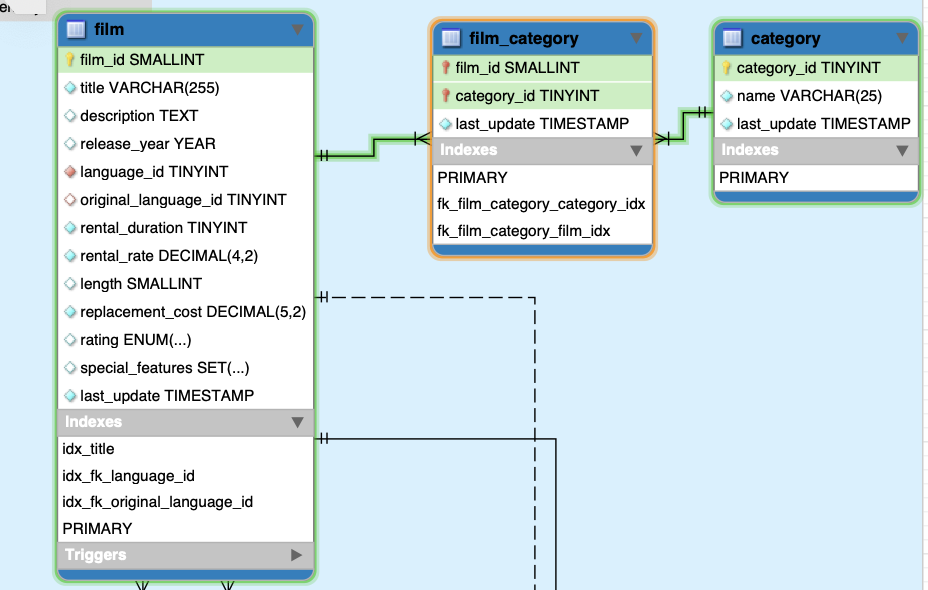
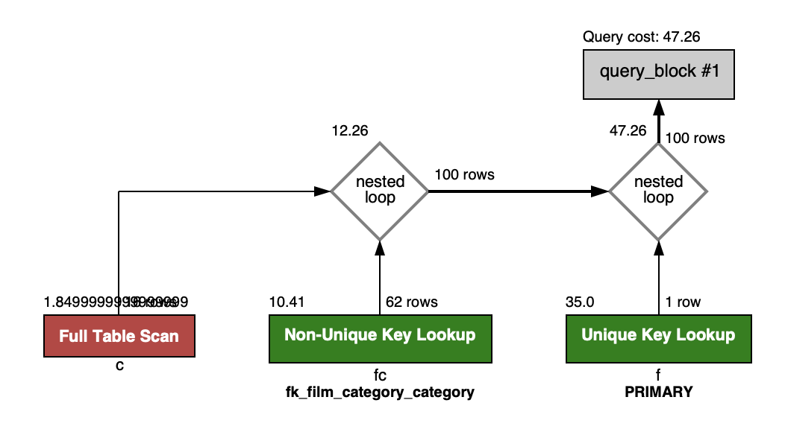
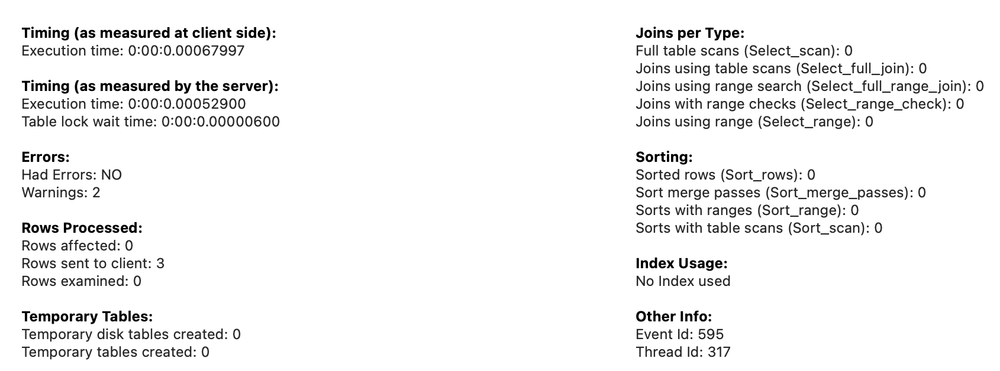

---\
Goal


practice sql on parts I'm not too familiar with

---\
Config


database: sakila

# join 팁


## Q. 1:M 관계에서, M쪽 테이블 쿼리 후, 하인 테이블에 조인거는게 나을까? 아니면, 하인 테이블(1) 쿼리 후, 주인(M) 테이블 조인거는데 나을까?

A. 보통 주인/하인이나 1:M 기준 보다는, 큰쪽 테이블에서 작은쪽 테이블로 조인을 거는게 일반적이다.
왜냐하면, 일반 select query에서 엔티티 훓는 속도보다 join이 더 느린데,
큰 테이블에서 빠르게 훑으면서 느린 join은 개체수가 적은 테이블(usually 부모)에 거는게 더 빠르기 떄문.


# Q1. 1:M:N:1 검색




problem: 특정 카테고리 이름(ex. 'Action') 에 속하는 film 검색

## case1) using subquery twice

```sql
EXPLAIN
SELECT SQL_NO_CACHE *
FROM film
WHERE film.film_id IN (
	SELECT film_category.film_id
	FROM film_category
	WHERE film_category.category_id = (
		SELECT category_id
		FROM category
		WHERE category.name = 'Action'
	)
)
```


+-------------------------------------------------+
|                   SQLCHECK                      |
+-------------------------------------------------+
> RISK LEVEL    :: ALL ANTI-PATTERNS
> SQL FILE NAME :: test.sql
> COLOR MODE    :: ENABLED
> VERBOSE MODE  :: ENABLED
> DELIMITER     :: ;
-------------------------------------------------
==================== Results ===================
No issues found.


---


1. category 테이블을 subquery로 full scan을 한 듯? 왜 full scan 했는가? category.name을 인덱스 안걸어줬거든.
2. 아무리 full scan이어도 16개 rows밖에 안했는데, 성능이 10배가 차이나는게 놀날 노짜네. extra보면 using where 썼다고 보임.
3. film_category.id를 step1과 비교해서 얻은 row수가 총 64개라 저리 되있는거고. filtered는 여기서 쿼리한거 100%다 가져다 썼다는 거니까, 야물딱지게 검색했다는 뜻이군. (index/full scan 따지는건 다른 얘기겠지만..)
4. film_category의 type이 ref로 되있는데, ref는 where절에 인덱스 있으면 타는 애. extra 컬럼 보면, using where, using index라고 나온다. film_category 테이블의 category_id를 인덱스 걸어줬기 때문.
5. WHERE절에 IN을 쓴건, 내부적으로 INNER JOIN으로 처리된 듯 하다. 아래와 같은 sql을 써도 실행계획 보면 결과값이 똑같다.

```
SELECT *
FROM film AS f
INNER JOIN (
	SELECT film_category.film_id
	FROM film_category
	WHERE film_category.category_id = (
		SELECT category_id
		FROM category
		WHERE category.name = 'Action')
	) AS fc
ON f.film_id = fc.film_id;
```


읽는법
1. 왼쪽 아래서 오른쪽 위 순서대로 읽는다.
2. 각 박스 왼쪽위에 적힌 숫자는 cost이다.
3. 각 박스 하단에 bold체로 적혀있는건, SELECT시 사용한 key다.
4. nested loop은 join을 나타낸다.
5. 빨간색일 수록 성능이 안좋고, 초록색일 수록 성능이 좋다.

생각
1. 역시 full scan에 빨간불이 들어왔다. 근데 cost는 1.85밖에 안된다. cost는 io쪽 보다는 cpu쪽 비용인 듯 하다.
2. film_category와 category 테이블 full scan한걸 where절로 필터링 하는데, 이 때, category_id가 인덱스되있어서 얘를 기준으로 찾고, film_category 테이블의 category_id(FK)는 pk가 아니라 'non-unique key' lookup 이라고 나와있다.
3. film 테이블과 film_category 테이블을 INNER JOIN하는데, 인덱스 걸린 행을 연결짓기 때문에(film_id) 인덱스를 타고 조인함 -> hash match에 최적화 되어있어서 빠름. join시 N개의 행을 잇는데, hash match가 O(1)이니까, 결국 O(N)인 것.
4. film table에서 primary key인 (film_id)를 써서 lookup 으로 1 row를 봐서 잘 이어졌나 validation check함.


- 오 lock걸린 시간도 나오네?
- rows examined: 16은 db io가 아니라, join후에 이게 정말 맞게 join됬는지 확인하기 위해 16개의 rows를 봤다는거 아닐까?
- film_category 테이블과 film테이블 조인할 때, 한쪽은 pk이고, 다른쪽이 pk가 아닌 인덱스 조인하는데, 후자쪽 테이블이 맞는지 검증하는데 16개를 쓴게 아닐까?
- timing: 972um
	- nested subquery가 join 2번하는 것 보다 느린 이유 case2에서 후술


### feedback

sqlcheck 돌려본 결과, no issue found.


```sql
SELECT *
FROM film AS f
INNER JOIN (
	SELECT film_category.film_id
	FROM film_category
	WHERE film_category.category_id = (
		SELECT category_id
		FROM category
		WHERE category.name = 'Action')
	) AS fc
ON f.film_id = fc.film_id;
```

근데 이 코드도 case1코드랑 결과/성능은 똑같이 뽑히는데, sqlcheck 돌려보면 anti-pattern이라고 이슈 엄청뜬다.

왜지?

다른점은 where in -> join 으로 바꾼건데,
select * + join 안에 nested subquery 넣는게 anti-pattern인가 보다.


+-------------------------------------------------+
|                   SQLCHECK                      |
+-------------------------------------------------+
> RISK LEVEL    :: ALL ANTI-PATTERNS
> SQL FILE NAME :: test.sql
> COLOR MODE    :: ENABLED
> VERBOSE MODE  :: ENABLED
> DELIMITER     :: ;
-------------------------------------------------
==================== Results ===================

-------------------------------------------------
SQL Statement at line 1: select * from film as f inner join ( select film_category.film_id from
film_category where film_category.category_id = ( select category_id from
category where category.name = 'action') ) as fc on f.film_id = fc.film_id;
[test.sql]: (HIGH RISK) SELECT *

---
● Inefficiency in moving data to the consumer:
When you SELECT *, you're often retrieving more columns from the database than
your application really needs to function. This causes more data to move from
the database server to the client, slowing access and increasing load on your
machines, as well as taking more time to travel across the network. This is
especially true when someone adds new columns to underlying tables that didn't
exist and weren't needed when the original consumers coded their data access.

1. io를 좀 더 줄이고 싶다면, 필요한 column만 가져오라는데..
2. 근데 row를 io한 시점에서 몇개 column 더 가져오는게 속도상 큰 의미가 있으려나?
3. 여하튼 이 피드백은 select *을 임의로 한거니까 넘어간다.

---
● Indexing issues:
Consider a scenario where you want to tune a query to a high level of
performance. If you were to use *, and it returned more columns than you
actually needed, the server would often have to perform more expensive methods
to retrieve your data than it otherwise might. For example, you wouldn't be able
to create an index which simply covered the columns in your SELECT list, and
even if you did (including all columns [shudder]), the next guy who came around
and added a column to the underlying table would cause the optimizer to ignore
your optimized covering index, and you'd likely find that the performance of
your query would drop substantially for no readily apparent reason.

1. select * 한게 인덱스까지 영향을 주나? 아닌거 아냐?


---
● Binding
Problems:
When you SELECT *, it's possible to retrieve two columns of the same name from
two different tables. This can often crash your data consumer. Imagine a query
that joins two tables, both of which contain a column called "ID". How would a
consumer know which was which? SELECT * can also confuse views (at least in some
versions SQL Server) when underlying table structures change -- the view is not
rebuilt, and the data which comes back can be nonsense. And the worst part of it
is that you can take care to name your columns whatever you want, but the next
guy who comes along might have no way of knowing that he has to worry about
adding a column which will collide with your already-developed names.
[Matching Expression: select * at line 1]

1. select * 했을 때, from에서 다른 테이블도 명시한걸 의도치 않게 가져올 수 있겠구나. 안티패턴 맞네.
2. 유지보수할 때에도 select * 하면 어떤 의도를 가지고 이 query를 썼는지 파악하기 힘들 수 있겠네.

[test.sql]: (HIGH RISK) JOIN Without Equality Check
● Use = with JOIN:
JOIN should always have an equality check to ensure proper scope of records.
[Matching Expression: join ( select film_category.film_id from film_category where at line 3]


==================== Summary ===================
All Anti-Patterns and Hints  :: 2
>  High Risk   :: 2
>  Medium Risk :: 0
>  Low Risk    :: 0
>  Hints       :: 0


## case2) using join

```sql
EXPLAIN
SELECT SQL_NO_CACHE f.*
FROM film f
	JOIN film_category fc ON f.film_id = fc.film_id
	JOIN category c ON fc.category_id = c.category_id
WHERE c.name = 'Action';
```


+-------------------------------------------------+
|                   SQLCHECK                      |
+-------------------------------------------------+
> RISK LEVEL    :: ALL ANTI-PATTERNS
> SQL FILE NAME :: test.sql
> COLOR MODE    :: ENABLED
> VERBOSE MODE  :: ENABLED
> DELIMITER     :: ;
-------------------------------------------------
==================== Results ===================
No issues found.


1. index사용하는 primary, subquery에서 다 simple로 바뀌었다 -> 성능향상
2. 뭐야 category table에서 fullscan하는건 똑같네?



- 100 rows?
	- 16+62 = 78 rows여야 하는데, +22는 어디서 나왔지?
	- 최종 rows수가 64 인데 왜 100이지?
	- case1에서 64처음 나온건 subquery를 where절로 받아 뽑아낸게 64io라는거고, join때 64 나온건, pk로 조인하는건 pk가 유니크하니까, O(N * 1) 해서 이전 64개가 그대로 나온게 아닐까?
	- 그리고 case2에서도 c join fc 해서 100 io 나온 다음, 이걸 f 테이블과 조인시, pk로 조인하니까 똑같이 O(N * 1) 해서 100이 나온거고?
	- 그렇다면, 저 nested loop join이 다 같은 조인이 아니라, pk랑 조인하는건 빨리 뽑히는데, full table scan과 non-unique key로 조인하는건 기존 테이블 rows 수 대비(16+62 = 78) merge할 때 드는 io cost까지 더해진게 100이라는거네?


- cost
	- case2는 join을 2번해서 그런가 cost가 47로, case1대비 18더 높다.
	- 왜? case1는 merge를 1번밖에 안하는데 case2는 merge를 2번하니까. merge cpu 연산 비용이 높나 보다.



679um (case1보다 1.5배정도 빠르다. 물론 분산에 단일값 양극단 비교하면 다를 수도 있지만 평균적으로 본 경우)


---
Q. 왜 join 2번한게 nested subquery보다 빠른가?


case1) nested subquery 방식
1. category table을 full scan
2. category_film 테이블에 where로 이어줌
3. film join category_film

case2) join * 2 방식
1. category table을 full scan
2. category_film join category
3. film join category_film


explain visualizer을 보면, case2의 io가 100이고, case1의 io가 64인데도 불구하고, case2가 빠르다.

왜?

join은 optimizer가 잘 쓸 수 있도록 최적화 되어있음(index를 이용한다던가..)\
subquery는 아님.

심지어 nested subquery 쓰면, optimizer가 인덱스 안타고 inner subquery당 each row of outer subquery 를 연결하는 O(N^2) 뜰 수도 있음 -> 성능하락 심각

