# goal

what is GROUPBY & HAVING?


config: sakila database


# GROUP BY

group by는 보통 select에 aggregate function(ex. sum, count, min, max 등)을 쓸 때 사용한다.

아래 케이스의 경우, country로 group 하고, 거기에 속한 유저를 count()함.

## Q1. 나라별 회원 수 조회

```sql
SELECT co.country, count(cu.customer_id)
FROM customer AS cu
	LEFT JOIN address AS ad ON cu.address_id = ad.address_id
	LEFT JOIN city as ci ON ad.city_id = ci.city_id
	LEFT JOIN country as co ON ci.country_id = co.country_id
GROUP BY country
ORDER BY country
```

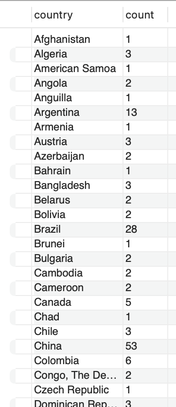


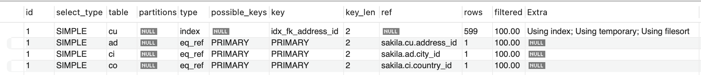

filtered를 보면 다 100%이긴 한데, rows를 보면 599임.

INNER JOIN 방식은 109+5+1+1 밖에 안됨.

---
Q. 왜 LEFT OUTER JOIN은 rows io가 600인데, INNER JOIN은 io가 114밖에 안될까?

LEFT OUTER JOIN 은 왼쪽애 기준으로 오른쪽 애를 합병하는건데,
여기서 왼쪽애가 customer table.
customer table의 사이즈가 600 rows.
따라서 600 rows io 하고, 얠 기준으로 address, city, country를 오른쪽에 붙이는 것.


반면에 INNER JOIN의 경우, country를 full scan한 다음(109 rows), 얘를 기준으로 city, address, customer 테이블을 inner join함.

그래서 둘이 io 차이가 나는 것


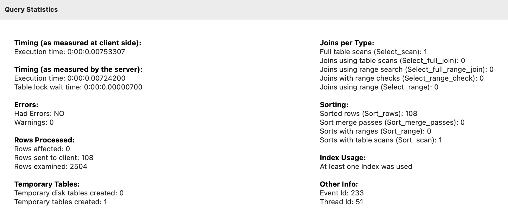

7.5ms -> INNER JOIN과 Latency 10배 차이난다.

rows examined가 2504나되는걸 보면, inner join과 차이 많이 나네

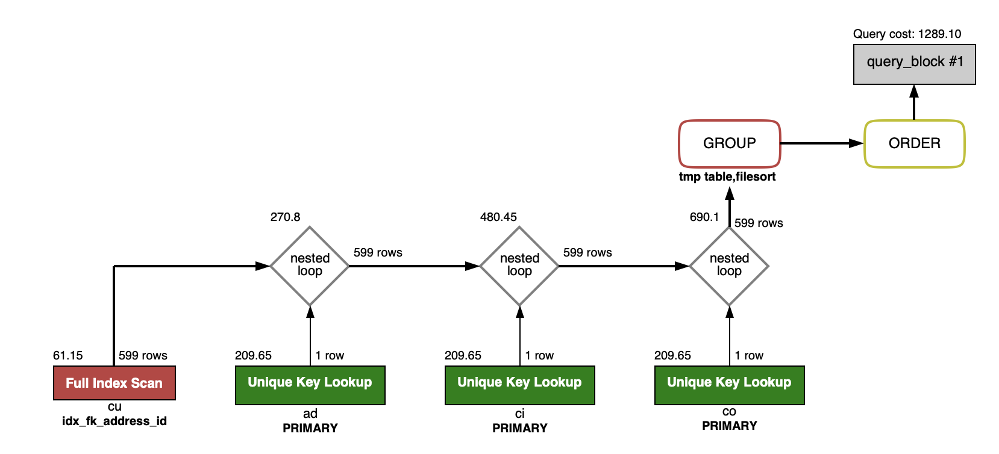

eq_ref는 LEFT OUTER JOIN에서 나왔음. join할 때 pk기준으로 조인하니까, unique-key-lookup 이니까

non-unique-key-lookup인 ref방식 쓰는 INNER JOIN과 비교해서 더 빠르긴 하지만,

애초에 599 rows를 full scan했다는 점에서 성능상 지고들어간다.


### Q. 이걸 만약에 INNER JOIN으로 바꾼다면?

```sql
explain
SELECT SQL_NO_CACHE co.country, count(cu.customer_id)
FROM customer AS cu
	INNER JOIN address AS ad ON cu.address_id = ad.address_id
	INNER JOIN city as ci ON ad.city_id = ci.city_id
	INNER JOIN country as co ON ci.country_id = co.country_id
GROUP BY country
ORDER BY country
```


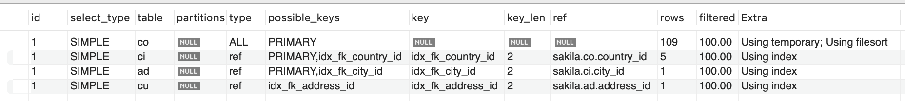

좀 신기한건, country_id, city_id, address_id 가 모두 pk인데, 여기선 eq_ref가 아닌 ref 찾아서 머지되네?


732nm -> OUTER JOIN 대비 latency 10배 차이.

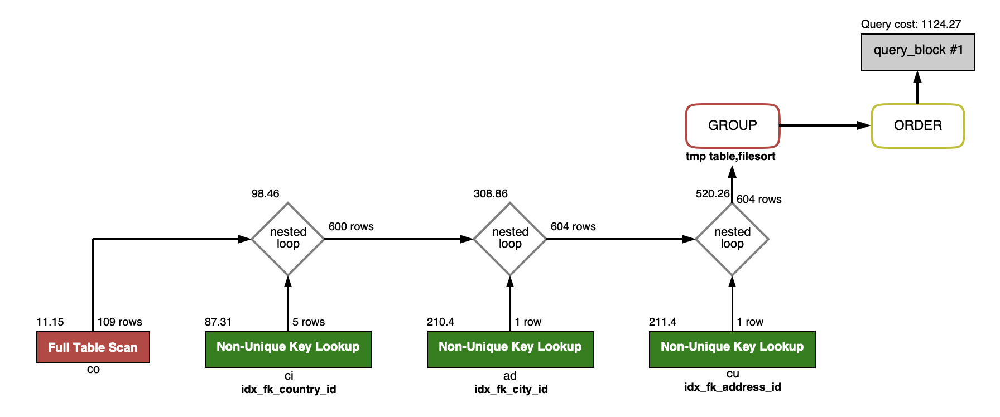

INNER JOIN시 맨 처음 customer table을 full scan하는게 아니라 country table을 full scan 하는데, 109 rows만 io하고 조인하기 때문에, LEFT OUTER JOIN 보다 성능이 좋다.


# HAVING

## Q. 그냥 WHERE절 쓰지, 왜 HAVING 씀?

### case1) WHERE절을 쓴 경우

```sql
SELECT SQL_NO_CACHE co.country, count(cu.customer_id)
FROM customer AS cu
	INNER JOIN address AS ad ON cu.address_id = ad.address_id
	INNER JOIN city as ci ON ad.city_id = ci.city_id
	INNER JOIN country as co ON ci.country_id = co.country_id
WHERE country IN ('south korea', 'japan', 'china')
GROUP BY country
ORDER BY country
```

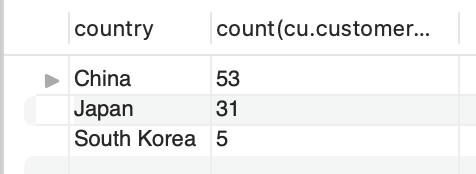

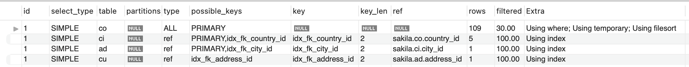

첫 줄에 country table을 30%만 filter 한다.

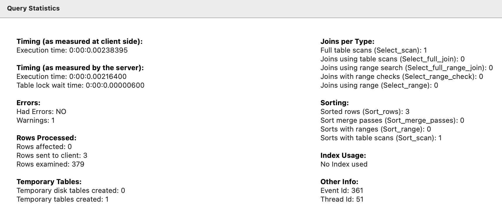

2.1ms latency

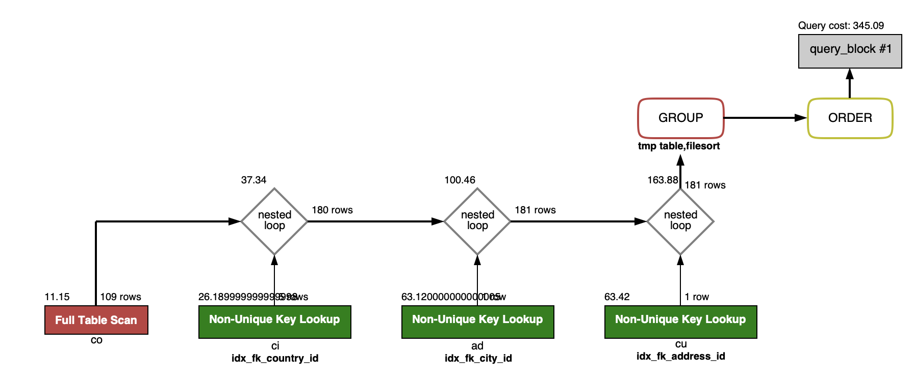

181 rows, 345 costs

where절을 했을 때,

내부적으로 맨 처음 country table full scan 후에(109 rows) 거기서 where절에서 충족되는 조건 rows만 필터링 한 후에 조인하나?

그래서 rows수가 적나?


### case2) HAVING을 쓴 경우

```sql
SELECT SQL_NO_CACHE co.country, count(cu.customer_id)
FROM customer AS cu
	INNER JOIN address AS ad ON cu.address_id = ad.address_id
	INNER JOIN city as ci ON ad.city_id = ci.city_id
	INNER JOIN country as co ON ci.country_id = co.country_id
GROUP BY country
HAVING country IN ('south korea', 'japan', 'china')
ORDER BY country
```


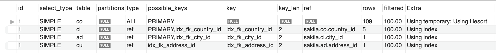

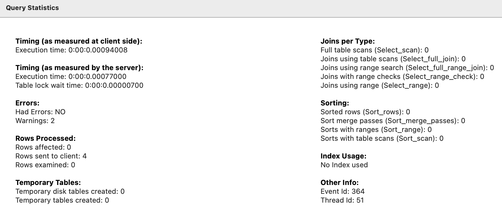

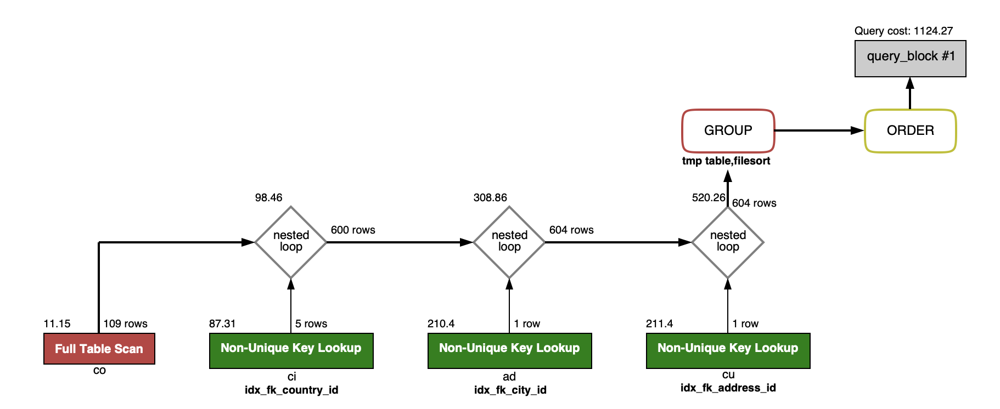

Q. country table full scan이 109rows인건 알겠는데,

왜 country join city 할 때, rows수가 600으로 늘어나지? inner join인데?

A. having은 group by한 '이후'에 나온 결과물을 조건검색함. case1의 경우, join할 때, 옵티마이저가 스마트하게 where절에 조건 보고 필요없는 rows를 미리 날리면서 조인했기 때문에, country join city 부터 rows수가 180rows 수밖에 안됬는데,

HAVING의 경우, 일단 join을 다 한 후에, 조건검색 하려니까, 일단 정석적으로 customer의 숫자인 600명치 다 조인하고 group by country한 다음, 필터링 하는 것.


### 그럼 HAVING은 언제 씀?

만약에 country 별 회원수 검색할 떄, 조건이 회원수가 10명 이상이어야 한다면?

```sql
SELECT SQL_NO_CACHE co.country, count(cu.customer_id) as count
FROM customer AS cu
	INNER JOIN address AS ad ON cu.address_id = ad.address_id
	INNER JOIN city as ci ON ad.city_id = ci.city_id
	INNER JOIN country as co ON ci.country_id = co.country_id
WHERE count > 10
GROUP BY country
ORDER BY country
```

이 때, where 쓰면 에러난다.

저 조건은 count)cu.customer_id)에 대해 group 한 다음에 걸리는 조건이라서, 이 때 HAVING 써야한다.

```sql
SELECT SQL_NO_CACHE co.country, count(cu.customer_id) as count
FROM customer AS cu
	INNER JOIN address AS ad ON cu.address_id = ad.address_id
	INNER JOIN city as ci ON ad.city_id = ci.city_id
	INNER JOIN country as co ON ci.country_id = co.country_id
GROUP BY country
HAVING count > 10
ORDER BY country
```


