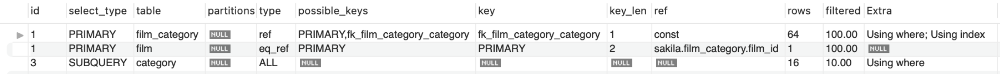

# A. explain 결과 읽는 법

핵심:
1. select_type을 보고 join 이 효율적으로 되는지 확인
2. key를 보고 의도한 인덱스 잘 타는지 확인
3. 같은 목적, 다르게 구현된 query의 rows 보고 비교
4. extra에서 의도하지 않은 테이블 만드는지 확인

## A.1. id
주의 해야 할 것은 id가 테이블의 실행순서를 의미하지는 않는다는 점입니다.

## A.2. select_type
SELECT 문의 유형을 의미합니다. 다음과 같은 종류가 있습니다.

---
performance in order
1. SIMPLE
	- 단순한 SELECT 문
	- 제일 빠르다
2. PRIMARY
	- 서브쿼리를 감싸는 외부 쿼리 or UNION이 포함될 경우 첫번째 SELECT 문
	- The performance depends on the complexity of the inner queries.
3. DERIVED
	- FROM 절에 작성된 서브쿼리
	- it can impact performance as they may require creating temporary tables
4. UNION
	1. UNION, UNION ALL로 합쳐진 SELECT 문
	2. UNION and UNION ALL can affect performance, as they involve combining the results of multiple SELECT statements
5. SUBQUERY
	- 독립적으로 수행되는 서브쿼리(SELECT, WHERE 절에 추가된 서브쿼리)
6. DEPENDENT SUBQUERY : 서브쿼리가 바깥쪽 SELECT 쿼리에 정의된 칼럼을 사용 하는 경우
7. DEPENDENT UNION
	- 외부에 정의된 칼럼을 UNION으로 결합된 쿼리에서 사용하는 경우
8. MATERIALZED
	- These queries create temporary tables for IN clause subqueries and join them, which can impact performance
9. UNCACHEABLE SUBQUERY
	- RAND(), UUID() 등 조회마다 결과가 달라지는 경우
	- caching 못하기 때문에 조회 성능이 나쁘다.

## A.3. type
인덱스 레인지 풀 스캔, 혹은 테이블 풀 스캔을 줄일 수 있는 방향으로 개선해야 합니다.

---
performance in order
1. system
	1. 테이블에 데이터가 없거나 한 개만 있는 경우
2. const
	1. pk나 unique key 를 where절에 넣어서 1개만 가져오는 쿼리
	2. This is very efficient since only one row is accessed.
3. eq_ref
	1. 조인이 수행될 때, join에서 가져오는 테이블의 pk로 검색하는 쿼리
	2. This is efficient since only one row is accessed from the joined table.
4. ref
	1. 일반 인덱스, key(firstname) 같은 애들 where절에 있을 때 발동되는 실행계획
	2. Similar to eq_ref, but the index used is not unique, and more than one row may match the condition. It is still efficient but may need to access multiple rows.
5. range
	1. 인덱스를 범위 스캔
	2. ex. first_name이 인덱스일 때, select * from employees where first_name >= 'A' and first_name <= 'B';
6. index
	1. 인덱스 풀 스캔
7. all
	1. 테이블 풀 스캔. 앵간하면 피해.
	2. 근데 인덱스 잘못 설정하거나, 검색 범위가 전체 데이터의 양의 대략 20%인가? 넘어가면 full scan이 더 빠름.
	3. 근데 얘는 인덱스 커버리지가 50%나 되니까 사용 안함.
	4. 예를들어, gender이 enum('m','f')인 경우, 인덱스가 어짜피 원본 데이터 1/2이고 그거 다 보고 기존 데이터 반틈 참조할 바에야, 원본데이터 full-scan이 더 빠름.
	5. gender에 인덱스 잡아봤자, 내부 엔진이 인덱스 쓰는게 구리다라는걸 판단하고 fullscan 쓴다.

## A.4. key
옵티마이저가 실제로 선택한 인덱스
possible_keys 중에서 하나를 선택한다.

## A.5. rows
SQL문을 수행하기 위해 접근하는 데이터의 모든 행 수

## A.6. filtered
검색한 rows 대비 실제로 우리가 찾던 row가 몇%인지 말해줌.

filtered를 보고, type에 인덱스 타거나 full scan 등 중 어느게 더 효과적인지 알 수 있다.

## A.6. extra

filesort나 group by를 위한 temp 테이블 생성보다 인덱스를 활용하여 sorting/group by를 수행할 수 있다면 성능을 개선할 수 있습니다.

---
performance in order
1.  Using index (Covering Index)
	- This is generally the most efficient because it allows the query to be processed using only the index, without needing to access the underlying data.
2.  Using where
	- This indicates that the query is using a WHERE clause to filter results.
	- The performance depends on the complexity of the filtering condition and the presence of appropriate indexes.
3.  Distinct
	- This is used to remove duplicates from the result set.
	- The performance impact depends on the size of the result set and the presence of appropriate indexes.
4.  Using Filesort
	- This indicates that the query requires sorting, which can be resource-intensive, especially for large result sets.
	- The presence of appropriate indexes can help improve the performance of sorting.
5.  Using temporary
	- This indicates that MySQL needs to create a temporary table to process the query, usually when it involves DISTINCT, GROUP BY, or ORDER BY clauses.
	- Creating a temporary table can be resource-intensive and can lead to performance issues, especially for large data sets.

