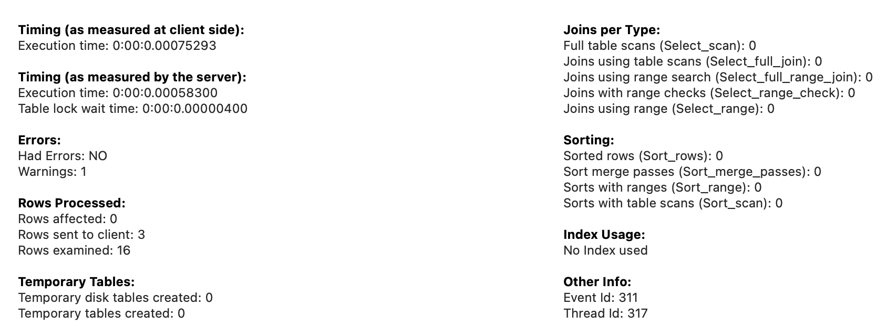
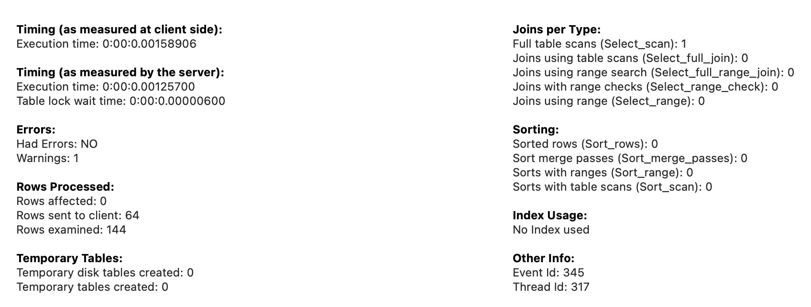

---\
Goal


practice sql on parts I'm not too familiar with

---\
Config


database: sakila


# A. explain 결과 읽는 법


핵심:
1. select_type을 보고 join 이 효율적으로 되는지 확인
2. key를 보고 의도한 인덱스 잘 타는지 확인
3. 같은 목적, 다르게 구현된 query의 rows 보고 비교
4. extra에서 의도하지 않은 테이블 만드는지 확인


## A.1. id
주의 해야 할 것은 id가 테이블의 실행순서를 의미하지는 않는다는 점입니다.

## A.2. select_type
SELECT 문의 유형을 의미합니다. 다음과 같은 종류가 있습니다.

---
performance in order
1. SIMPLE
	- 단순한 SELECT 문
	- 제일 빠르다
2. PRIMARY
	- 서브쿼리를 감싸는 외부 쿼리 or UNION이 포함될 경우 첫번째 SELECT 문
	- The performance depends on the complexity of the inner queries.
3. DERIVED
	- FROM 절에 작성된 서브쿼리
	- it can impact performance as they may require creating temporary tables
4. UNION
	1. UNION, UNION ALL로 합쳐진 SELECT 문
	2. UNION and UNION ALL can affect performance, as they involve combining the results of multiple SELECT statements
5. SUBQUERY
	- 독립적으로 수행되는 서브쿼리(SELECT, WHERE 절에 추가된 서브쿼리)
6. DEPENDENT SUBQUERY : 서브쿼리가 바깥쪽 SELECT 쿼리에 정의된 칼럼을 사용 하는 경우
7. DEPENDENT UNION
	- 외부에 정의된 칼럼을 UNION으로 결합된 쿼리에서 사용하는 경우
8. MATERIALZED
	- These queries create temporary tables for IN clause subqueries and join them, which can impact performance
9. UNCACHEABLE SUBQUERY
	- RAND(), UUID() 등 조회마다 결과가 달라지는 경우
	- caching 못하기 때문에 조회 성능이 나쁘다.


## A.3. type
인덱스 레인지 풀 스캔, 혹은 테이블 풀 스캔을 줄일 수 있는 방향으로 개선해야 합니다.

---
performance in order
1. system
	1. 테이블에 데이터가 없거나 한 개만 있는 경우
2. const
	1. pk나 unique key 를 where절에 넣어서 1개만 가져오는 쿼리
	2. This is very efficient since only one row is accessed.
3. eq_ref
	1. 조인이 수행될 때, join에서 가져오는 테이블의 pk로 검색하는 쿼리
	2. This is efficient since only one row is accessed from the joined table.
4. ref
	1. 일반 인덱스, key(firstname) 같은 애들 where절에 있을 때 발동되는 실행계획
	2. Similar to eq_ref, but the index used is not unique, and more than one row may match the condition. It is still efficient but may need to access multiple rows.
5. range
	1. 인덱스를 범위 스캔
	2. ex. first_name이 인덱스일 때, select * from employees where first_name >= 'A' and first_name <= 'B';
6. index
	1. 인덱스 풀 스캔
7. all
	1. 테이블 풀 스캔. 앵간하면 피해.
	2. 근데 인덱스 잘못 설정하거나, 검색 범위가 전체 데이터의 양의 대략 20%인가? 넘어가면 full scan이 더 빠름.
	3. 근데 얘는 인덱스 커버리지가 50%나 되니까 사용 안함.
	4. 예를들어, gender이 enum('m','f')인 경우, 인덱스가 어짜피 원본 데이터 1/2이고 그거 다 보고 기존 데이터 반틈 참조할 바에야, 원본데이터 full-scan이 더 빠름.
	5. gender에 인덱스 잡아봤자, 내부 엔진이 인덱스 쓰는게 구리다라는걸 판단하고 fullscan 쓴다.

## A.4. key
옵티마이저가 실제로 선택한 인덱스
possible_keys 중에서 하나를 선택한다.


## A.5. rows
SQL문을 수행하기 위해 접근하는 데이터의 모든 행 수


## A.6. filtered
검색한 rows 대비 실제로 우리가 찾던 row가 몇%인지 말해줌.

filtered를 보고, type에 인덱스 타거나 full scan 등 중 어느게 더 효과적인지 알 수 있다.


## A.6. extra

filesort나 group by를 위한 temp 테이블 생성보다 인덱스를 활용하여 sorting/group by를 수행할 수 있다면 성능을 개선할 수 있습니다.

---
performance in order
1.  Using index (Covering Index)
	- This is generally the most efficient because it allows the query to be processed using only the index, without needing to access the underlying data.
2.  Using where
	- This indicates that the query is using a WHERE clause to filter results.
	- The performance depends on the complexity of the filtering condition and the presence of appropriate indexes.
3.  Distinct
	- This is used to remove duplicates from the result set.
	- The performance impact depends on the size of the result set and the presence of appropriate indexes.
4.  Using Filesort
	- This indicates that the query requires sorting, which can be resource-intensive, especially for large result sets.
	- The presence of appropriate indexes can help improve the performance of sorting.
5.  Using temporary
	- This indicates that MySQL needs to create a temporary table to process the query, usually when it involves DISTINCT, GROUP BY, or ORDER BY clauses.
	- Creating a temporary table can be resource-intensive and can lead to performance issues, especially for large data sets.


# Q1. 1:M:N:1 검색


problem: 특정 카테고리 이름(ex. 'Action') 에 속하는 film 검색

## case1) using subquery twice

```sql
EXPLAIN
SELECT SQL_NO_CACHE *
FROM film
WHERE film.film_id IN (
	SELECT film_category.film_id
	FROM film_category
	WHERE film_category.category_id = (
		SELECT category_id
		FROM category
		WHERE category.name = 'Action'
	)
)
```


1. category 테이블을 subquery로 full scan을 한 듯? 왜 full scan 했는가? category.name을 인덱스 안걸어줬거든.
2. 아무리 full scan이어도 16개 rows밖에 안했는데, 성능이 10배가 차이나는게 놀날 노짜네. extra보면 using where 썼다고 보임.
3. film_category.id를 step1과 비교해서 얻은 row수가 총 64개라 저리 되있는거고. filtered는 여기서 쿼리한거 100%다 가져다 썼다는 거니까, 야물딱지게 검색했다는 뜻이군. (index/full scan 따지는건 다른 얘기겠지만..)
4. film_category의 type이 ref로 되있는데, ref는 where절에 인덱스 있으면 타는 애. extra 컬럼 보면, using where, using index라고 나온다. film_category 테이블의 category_id를 인덱스 걸어줬기 때문.
5. WHERE절에 IN을 쓴건, 내부적으로 INNER JOIN으로 처리된 듯 하다. 아래와 같은 sql을 써도 실행계획 보면 결과값이 똑같다.

```
SELECT *
FROM film AS f
INNER JOIN (
	SELECT film_category.film_id
	FROM film_category
	WHERE film_category.category_id = (
		SELECT category_id
		FROM category
		WHERE category.name = 'Action')
	) AS fc
ON f.film_id = fc.film_id;
```


읽는법
1. 왼쪽 아래서 오른쪽 위 순서대로 읽는다.
2. 각 박스 왼쪽위에 적힌 숫자는 cost이다.
3. 각 박스 하단에 bold체로 적혀있는건, SELECT시 사용한 key다.
4. nested loop은 join을 나타낸다.
5. 빨간색일 수록 성능이 안좋고, 초록색일 수록 성능이 좋다.

생각
1. 역시 full scan에 빨간불이 들어왔다. 근데 cost는 1.85밖에 안된다. cost는 io쪽 보다는 cpu쪽 비용인 듯 하다.
2. film_category와 category 테이블 full scan한걸 where절로 필터링 하는데, 이 때, category_id가 인덱스되있어서 얘를 기준으로 찾고, film_category 테이블의 category_id(FK)는 pk가 아니라 'non-unique key' lookup 이라고 나와있다.
3. film 테이블과 film_category 테이블을 INNER JOIN하는데, 인덱스 걸린 행을 연결짓기 때문에(film_id) 인덱스를 타고 조인함 -> hash match에 최적화 되어있어서 빠름. join시 N개의 행을 잇는데, hash match가 O(1)이니까, 결국 O(N)인 것.
4. film table에서 primary key인 (film_id)를 써서 lookup 으로 1 row를 봐서 잘 이어졌나 validation check함.



- 오 lock걸린 시간도 나오네?
- rows examined: 16은 db io가 아니라, join후에 이게 정말 맞게 join됬는지 확인하기 위해 16개의 rows를 봤다는거 아닐까?
- 근데 case2보다 rows examined가 훨씬 적은 이유는(거의 1/10), film_category 테이블과 film테이블 조인할 때, 한쪽은 pk이고, 다른쪽이 pk가 아닌 인덱스 조인하는데, 후자쪽 테이블이 맞는지 검증하는데 16개를 쓴거고, case2의 경우, 일단 join도 두번하는데, join시 중간에 pk가 아닌 인덱스로 조인하는 film_category가 껴있어서 rows_examined가 저리 많은게 아닐까?
- timing: 752um
	- case2보다 약 1.7배 빠른 이유는, subquery는 join을 한번하는데, case2는 join을 2번해서 그런가?


## case2) using join

```sql
EXPLAIN
SELECT SQL_NO_CACHE f.*
FROM film f
	JOIN film_category fc ON f.film_id = fc.film_id
	JOIN category c ON fc.category_id = c.category_id
WHERE c.name = 'Action';
```


1. index사용하는 primary, subquery에서 다 simple로 바뀌었다 -> 성능향상
2. 뭐야 category table에서 fullscan하는건 똑같네?


- cost
	- case2는 join을 2번해서 그런가 cost가 47로, case1대비 18더 높다.
	- case1은 subquery의 결과를 where절에서 = 연산하고, case2는 join하고의 차이인데, join은 n^2라고 쳐. equal 연산은 저거보다 빠르니까 적게나온거아냐?
	- 아 case1에서 category 테이블을 subquery한건 O(N)인데, 그걸 where절로 받는 컬럼이 인덱스 걸려있어서 O(1)이니까, O(N)이기 때문에 case2보다 빠른거구나
- 100 rows?
	- 16+62 = 78 rows여야 하는데, 22는 어디서 나왔지?
	- join하고 난 다음에, 이게 join이 잘 됬나 확인하는걸 22rows io로 한게 아닐까?
	- 첫번째 join은 보면 non-unique key lookup이라고 되있는데, pk가 아닌 컬럼의 인덱스를 기준으로 조인하는건, pk가 아니다보니 unique하지 않으니까, join한걸 확인하는 추가작업비용이 더 드는거고,
	- 두번째 join은 film 테이블의 pk로 join하니까, unique한게 보장되니까 O(1*N)으로 빠르게 조인하고 딱 한 row만 검증하는식이 아닐까?



1257um

아무래도 join을 두번하다 보니까, case1에 비해 cost도 많이 나오고 latency도 느리다.
