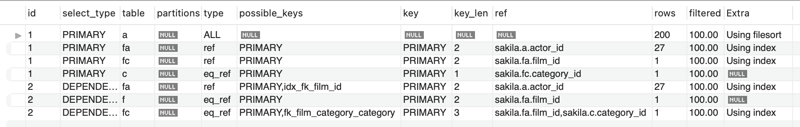
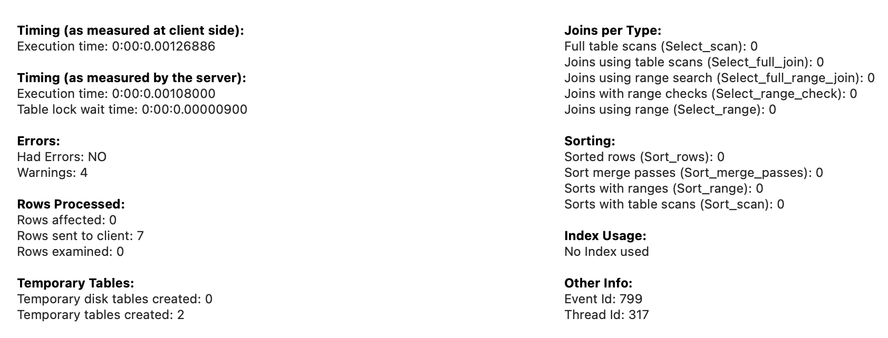
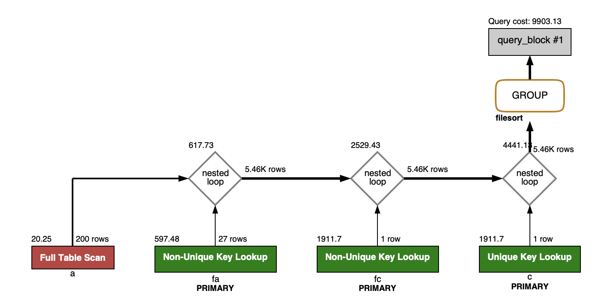
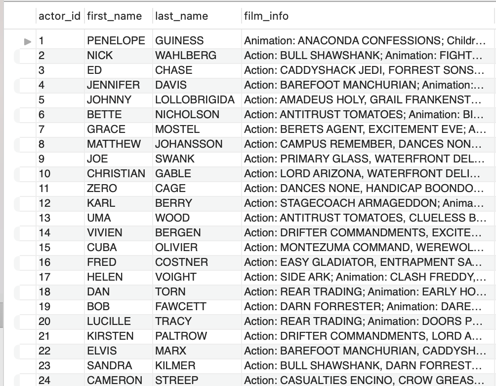
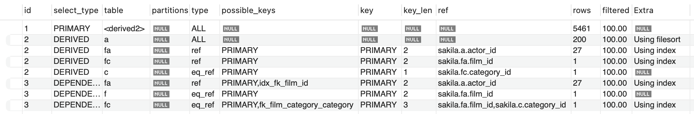
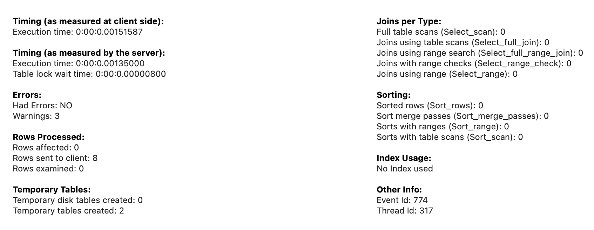
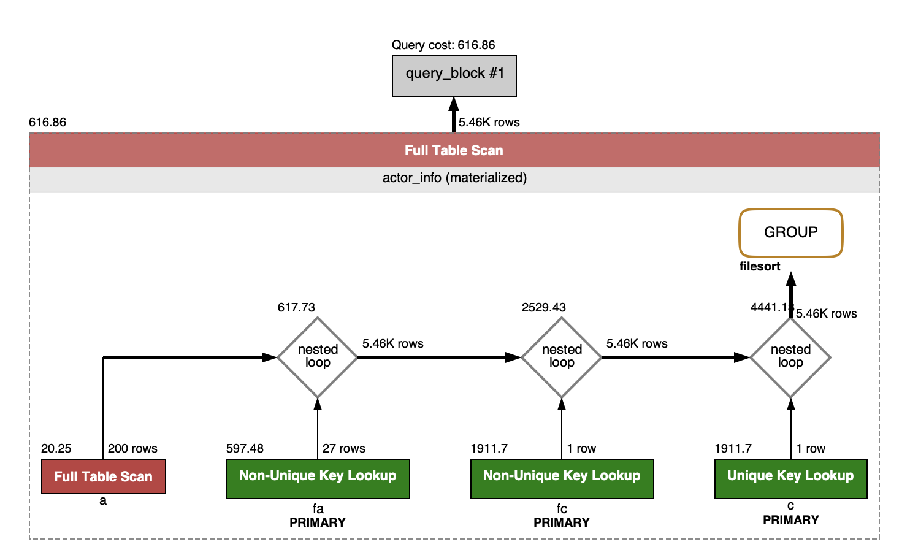

---\
Goal


understand index based query


---\
Config


sakila


# View

Q. 왜 뷰 씀?

A. actor table에는 id, firstname, lastname 밖에 없는데,

만약 배우 이름+ 배우가 참가한 영화 리스트 정보를 필요로 하는 페이지가 있다면?

options
1. 매 요청마다 join하고 concat()한다.
2. 새로운 테이블 만든다.
3. view 만든다

## option1. 매 요청마다 join하고 concat()한다.

```
SELECT SQL_NO_CACHE
a.actor_id,
a.first_name,
a.last_name,
GROUP_CONCAT(DISTINCT CONCAT(c.name, ': ',
		(SELECT GROUP_CONCAT(f.title ORDER BY f.title SEPARATOR ', ')
                    FROM sakila.film f
                    INNER JOIN sakila.film_category fc
                      ON f.film_id = fc.film_id
                    INNER JOIN sakila.film_actor fa
                      ON f.film_id = fa.film_id
                    WHERE fc.category_id = c.category_id
                    AND fa.actor_id = a.actor_id
                 )
             )
             ORDER BY c.name SEPARATOR '; ')
AS film_info
FROM sakila.actor a
LEFT JOIN sakila.film_actor fa
  ON a.actor_id = fa.actor_id
LEFT JOIN sakila.film_category fc
  ON fa.film_id = fc.film_id
LEFT JOIN sakila.category c
  ON fc.category_id = c.category_id
GROUP BY a.actor_id, a.first_name, a.last_name
```

페이지 요청이 얼마나 많거나 없을진 모르겠는데,

페이지 요청이 많은데 매 요청마다 이걸한다?

비추

view 쓰면 인덱스 못타긴 하지만,

```sql
SELECT count(*) FROM actor_info;
```

해보면 200 rows밖에 없다.

저 많은 테이블들 join하고 group by 하는 것 보다, 200 rows fulls can하는게 더 빠를 듯.



group by 떄문에 actor table의 extra가 'using filesort' 쓴 듯?



놀랍게도. view의 latency와 별 차이 없다.

view가 더 빠를거라 생각했는데..




근데 cost가 9903으로 미친듯이 높다.

그야 당연히 join & group by 여러번 했으니까.

cpu intensive + lock on many tables

게다가 actor table을 full scan한다.

어짜피 view가 full scan해서 성능이 안좋은거라면, option1도 actor table(200 rows)을 full scan한다.

view도 200 rows를 full scan한다.


## option2. 새로운 테이블 만든다.

비추
1. 정규화 깨야함. 비정규화 해서 얻는 성능 이점은 cache같은 애로 커버 가능한데, 나중에 다시 정규화 시키는거 어려움.
2. view로 만들어서 걸리는 latency가 1.5ms인데, 200rows 밖에 fulls can 안하기 때문에 빠른 편. 이정도면 비정규화 하면서 까지 추가 테이블 만들 필요 없는 듯 하다.
3. 테이블 관리 비용(메모리 + 인덱스) 증가. 불필요하게.

## option3. view
```sql
SELECT * FROM actor_info;
```



actor table과 해당 view와 다른점은,

film_info 컬럼에서
1. 해당 배우가 참여한 영화의 카테고리:
2. 해당 배우가 참여한 영화의 리스트(';'로 구분짓는다)




option1과 유일한 차이점은 id1에 `<derived2>`가 생긴 것. 이게 view.

근데 view라는게, 저 id 2번들 다 없고 id1만 있어야 하는거 아닌가?

아니면, 사실 id1만 실행하는데, view니까 친절하게 view만들 때 sql이 어떻게 흘러갔을지도 보여주는건가?




latency: 1.5ms

option1과 성능이 비슷하다.

1. 200 rows를 full scan하는 속도랑 option1의 속도가 비슷하거나,
2. 아니면 option3을 read했는데 내부적으로는 option1 한 다음 결과물을 read했거나 인데,

1이길 바라는데 2일거같은데..



option1과 latency는 비슷한데,

query cost가 9903 -> 616

1/16 감소.

만에하나 진짜로 latency가 option1과 비슷하다 하더라도, cpu cost 때문이라도 view 쓰는게 더 낫다.

